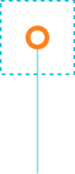
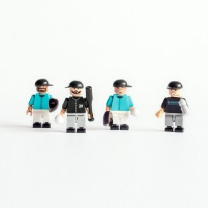
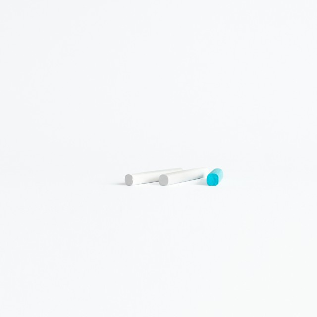
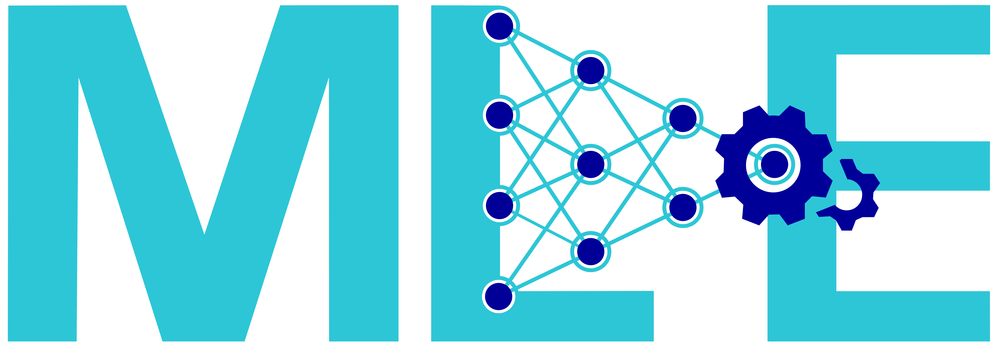
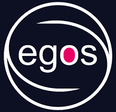
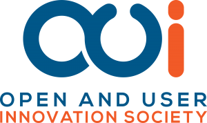
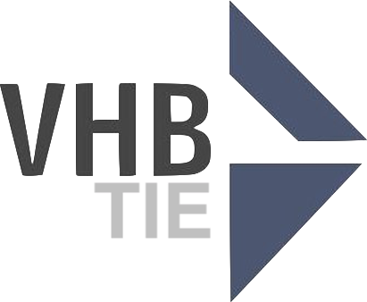

::: {.hero-banner style="background-image: url('assets/images/docks.jpg');"}
::: {.hero-content}

::: {.hero-text}
[Welcome to the [TUHH](https://www.tuhh.de)]{.hero-subtitle}

[Institute of Entrepreneurship]{.hero-title}

{.hero-illu}
:::

::: {.hero-carousel}
```{=html}
<div id="heroCarousel" class="carousel slide" data-bs-ride="carousel" data-bs-interval="5000">
  <div class="carousel-indicators">
    <button type="button" data-bs-target="#heroCarousel" data-bs-slide-to="0" class="active" aria-current="true" aria-label="Team"></button>
    <button type="button" data-bs-target="#heroCarousel" data-bs-slide-to="1" aria-label="Research"></button>
    <button type="button" data-bs-target="#heroCarousel" data-bs-slide-to="2" aria-label="Teaching"></button>
    <button type="button" data-bs-target="#heroCarousel" data-bs-slide-to="3" aria-label="Transfer"></button>
  </div>
  <div class="carousel-inner">
    <div class="carousel-item active">
      <a href="team.html" class="teaser-card">
        <div class="teaser-img"><span class="teaser-credit">© Anne Gärtner</span></div>
        <div class="teaser-body">
          <h3>Team</h3>
          <span class="teaser-cta">Meet our team.</span>
        </div>
      </a>
    </div>
    <div class="carousel-item">
      <a href="research.html" class="teaser-card">
        <div class="teaser-img"><span class="teaser-credit">© Anne Gärtner</span></div>
        <div class="teaser-body">
          <h3>Research</h3>
          <span class="teaser-cta">Explore our research.</span>
        </div>
      </a>
    </div>
    <div class="carousel-item">
      <a href="teaching.html" class="teaser-card">
        <div class="teaser-img"><span class="teaser-credit">© Anne Gärtner</span></div>
        <div class="teaser-body">
          <h3>Teaching</h3>
          <span class="teaser-cta">Join our courses.</span>
        </div>
      </a>
    </div>
    <div class="carousel-item">
      <a href="transfer.html" class="teaser-card">
        <div class="teaser-img"><span class="teaser-credit">© Anne Gärtner</span></div>
        <div class="teaser-body">
          <h3>Collaborate</h3>
          <span class="teaser-cta">Let's work together.</span>
        </div>
      </a>
    </div>
  </div>
  <button class="carousel-control-prev" type="button" data-bs-target="#heroCarousel" data-bs-slide="prev">
    <span class="carousel-control-prev-icon" aria-hidden="true"></span>
    <span class="visually-hidden">Previous</span>
  </button>
  <button class="carousel-control-next" type="button" data-bs-target="#heroCarousel" data-bs-slide="next">
    <span class="carousel-control-next-icon" aria-hidden="true"></span>
    <span class="visually-hidden">Next</span>
  </button>
</div>
```
:::

:::

[Dock-1, &copy; [Victor Klassen](https://victorklassen.de)]{.backimage-caption}
:::


::: {.objectives-section}
::: {.content-block}

::: {.mission-statement}
We advance innovation and entrepreneurship<br>through [**rigorous empirical research**](research.qmd),<br>[**a scientific approach to entrepreneurship education**](teaching.qmd),<br>and [**real-world collaborations**](transfer.qmd)<br>— shaping the next generation of [Startup Engineers.]{style="color: #FF7E15;"}
:::

:::
:::


::: {.news-section}
::: {.content-block}

## Recent News {.section-heading}

::: {.placeholder-text}
Coming soon — news content will be added in a later phase.
:::

:::
:::


::: {.research-section}
::: {.content-block}

## Featured Research {.section-heading}

::: {.placeholder-text}
Coming soon — research highlights will be added in a later phase.
:::

:::
:::


::: {.affiliations-section}
::: {.content-block}

## Affiliations {.section-heading}

::: {.logo-grid}

[](https://www.tuhh.de/)
[](https://www.tuhh.de/sdw/dekanat.html)
[](https://www.tuhh.de/mle/homepage)
[](http://druid.dk)
[](http://aom.org)
[](http://www.egosnet.org)
[](http://www.oui-society.org)
[](https://www.vhbonline.org/wk-/-fachgruppen/technologie-innovation-und-entrepreneurship-tie)

:::

:::
:::

```{=html}
<script>
(function() {
  const hero = document.querySelector('.hero-banner');
  if (!hero) return;
  window.addEventListener('scroll', function() {
    var scrolled = window.scrollY;
    var maxShift = hero.offsetHeight * 0.4;
    var shift = Math.min(scrolled * 0.8, maxShift);
    hero.style.backgroundPositionY = 'calc(100% + ' + shift + 'px)';
  }, { passive: true });
})();
</script>
```
