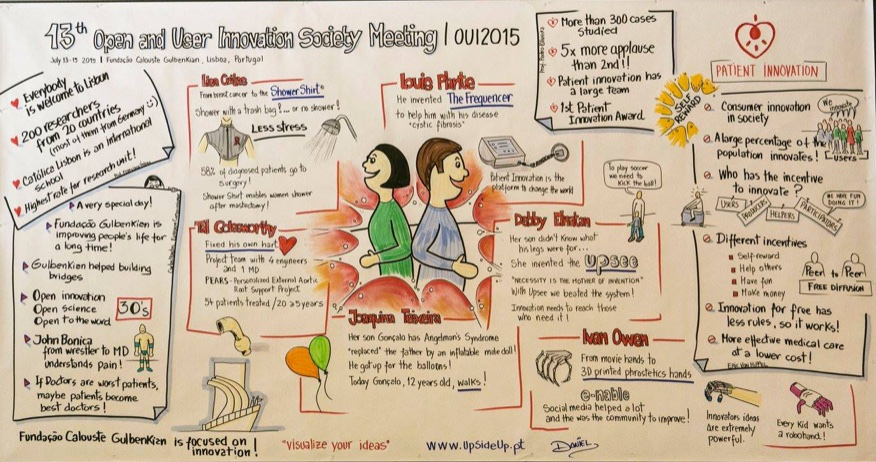

::: {.page-header style="background-image: url('../../assets/images/banners/news.jpg');"}
[News]{.page-header__title}

[&copy; [Anne Gärtner](https://www.gaertner-photo.de)]{.backimage-caption}
:::

::: {.content-section}
::: {.content-block}
::: {.profile-page}

::: {.profile-sidebar}
{.profile-avatar .detail-image}

::: {.pub-meta}
-  13.07.2015
-  TIE Team
-  Conference
:::

:::

::: {.profile-main}

The OUI 2015 was organized by the Catolica Lisbon School of Business & Economics. It is the leading academic conference on Open and User Innovation. Around 200 researchers from various disciplines (such as innovation management, health, strategic management, organization, design, marketing, entrepreneurship, and public policy) meet annually, in order to exchange recent research findings and plans related to Open and User Innovation. Christoph Ihl and Hannes Lampe joined this conference.

:::

:::
:::
:::
