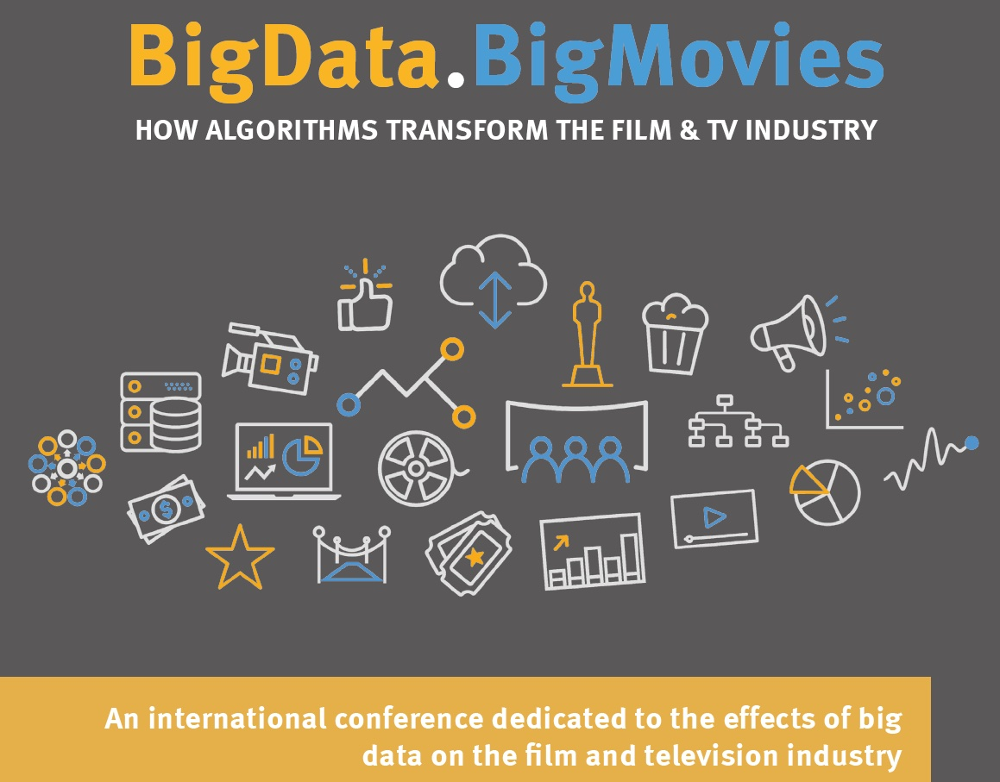

::: {.page-header style="background-image: url('../../assets/images/banners/news.jpg');"}
[News]{.page-header__title}

[&copy; [Anne Gärtner](https://www.gaertner-photo.de)]{.backimage-caption}
:::

::: {.content-section}
::: {.content-block}
::: {.profile-page}

::: {.profile-sidebar}
{.profile-avatar .detail-image}

::: {.pub-meta}
-  22.09.2016
-  TIE Team
-  Conference
:::

:::

::: {.profile-main}

An international conference dedicated to the effects of big data on the film and television industry. The latest developments, the future of the industry, and the impact of big data on the film business and media projects were discussed by scientists and representatives of the media industry. A broad range of topics in market research, marketing strategy and risk management were the focus.

:::

:::
:::
:::
