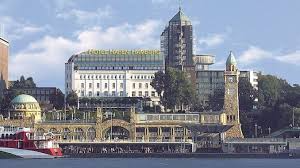

::: {.page-header style="background-image: url('../../assets/images/banners/news.jpg');"}
[News]{.page-header__title}

[&copy; [Anne Gärtner](https://www.gaertner-photo.de)]{.backimage-caption}
:::

::: {.content-section}
::: {.content-block}
::: {.profile-page}

::: {.profile-sidebar}
{.profile-avatar .detail-image}

::: {.pub-meta}
-  30.11.2017
-  TIE Team
-  Conference
:::

:::

::: {.profile-main}

This year's research colloquium on "Innovation and Value Creation" took place in Hamburg. Around 60 to 80 scholars from various research backgrounds — innovation management, entrepreneurship, organization and workplace design, information systems, and public policy — met to exchange recent research findings and future research plans.

The kick-off event started in the very traditional "Hotel Hafen Hamburg". Members of the research group were welcomed by Profs. Ralf Reichwald and Christoph Ihl. Our guests were hosted in a very Hanseatic atmosphere with excellent view on "St. Pauli Landungsbrücken". This was a wonderful evening together with many members of the so-called "Reichwald-Family" from renowned universities such as TUM, RWTH, UE, TUC, JKU, UM, HHL, HSU, FAU, UH, FHS and TUHH.

Next morning, the conference started at the InnovationCampus Green Technologies (ICGT) located in the small harbor of Harburg. Prof. Dr. Andreas Timm-Giel, Vice-President of TUHH welcomed the participants and was followed by Dr. Carsten Brosda, Hamburg Senator for Culture and Media. His lecture was titled: "Wie entwickelt sich die Handelsstadt Hamburg zur digitalen Stadt mit Zukunft?" (How will Hamburg develop from a trade city to a digital city in future?). Then, an equally interesting speech was held by Prof. Linus Dahlander from ESMT, Berlin.

Scholars were organized into three parallel sessions to present their latest research and receive feedback from experienced researchers. This was a valuable opportunity for early-career researchers to develop their work within a trusted community.

The ultimate session took place at the "Empire Riverside Hotel" on Saturday morning. Our PhD students received input for their future research and were glad about having met other researchers working on similar fields of study.

:::

:::
:::
:::
