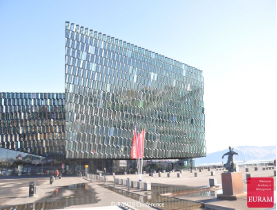

::: {.page-header style="background-image: url('../../assets/images/banners/news.jpg');"}
[News]{.page-header__title}

[&copy; [Anne Gärtner](https://www.gaertner-photo.de)]{.backimage-caption}
:::

::: {.content-section}
::: {.content-block}
::: {.profile-page}

::: {.profile-sidebar}
{.profile-avatar .detail-image}

::: {.pub-meta}
-  19.06.2018
-  TIE Team
-  Conference
:::

:::

::: {.profile-main}

We presented the following papers:

- "What we know versus who we know"; by Dimitri Graf and Christoph Ihl
- "Does Choice of Teams and Ideas improve Performance in Entrepreneurial Teams? Evidence from a Field Experiment"; by Viktoria Kessler, Christoph Ihl and Rajshri Jayaraman (ESMT)
- "Herding and the Role of Experts in Equity Crowdfunding Markets"; by Jan Niklas Wick and Christoph Ihl

:::

:::
:::
:::
