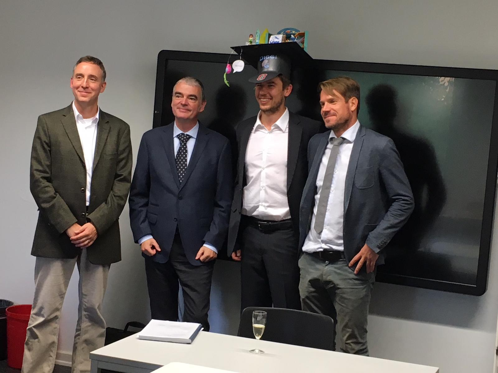

::: {.page-header style="background-image: url('../../assets/images/banners/news.jpg');"}
[News]{.page-header__title}

[&copy; [Anne Gärtner](https://www.gaertner-photo.de)]{.backimage-caption}
:::

::: {.content-section}
::: {.content-block}
::: {.profile-page}

::: {.profile-sidebar}
{.profile-avatar .detail-image}

::: {.pub-meta}
-  01.09.2018
-  TIE Team
-  PhD Thesis
:::

:::

::: {.profile-main}

Multiple studies validated effects of institutions on the diffusion of scientific innovations, but there is a lack in explaining emergence and change of institutions. The institutional entrepreneurship approach faces this limitations and models, how institutional entrepreneurs diffuse an institutional logic to then create institutions in order to facilitate diffusion of innovations. In this thesis, three studies endeavor to validate this end-to-end process beginning from institutional entrepreneurs diffusing a logic to the impact of created institutions on the diffusion of innovation. By drawing from quantitative analyses in the field of synthetic biology, we validate theories on institutional entrepreneurs driving diffusion of institutional logics and a positive impact of open science on knowledge diffusion.

Examiners: Prof. Dr. Christoph Ihl and Prof. Dr. Martin G. Möhrle

Day of Oral Doctoral Examination: 14.09.2018

:::

:::
:::
:::
