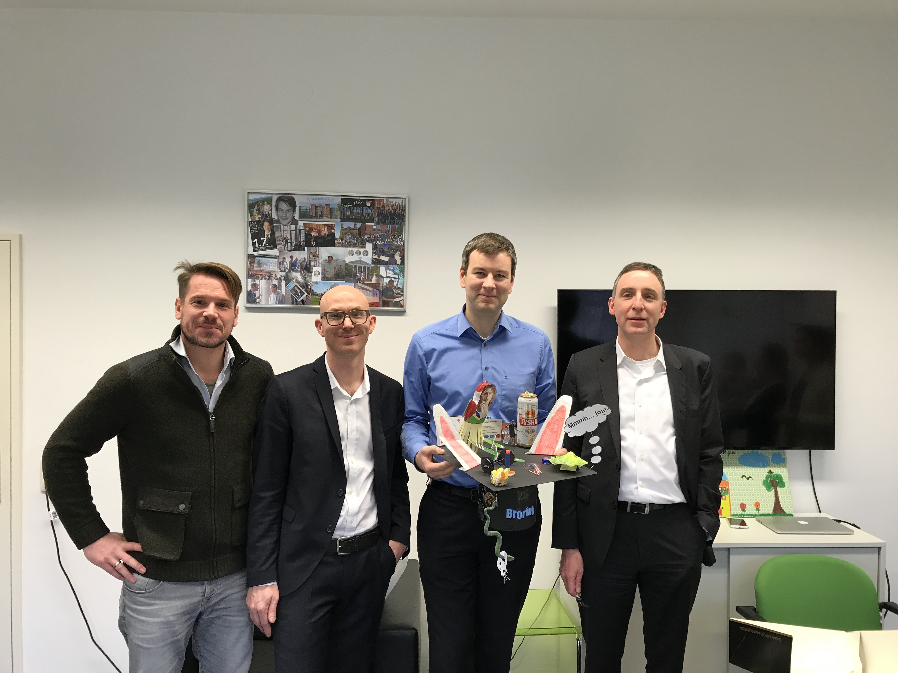

::: {.page-header style="background-image: url('../../assets/images/banners/news.jpg');"}
[News]{.page-header__title}

[&copy; [Anne Gärtner](https://www.gaertner-photo.de)]{.backimage-caption}
:::

::: {.content-section}
::: {.content-block}
::: {.profile-page}

::: {.profile-sidebar}
{.profile-avatar .detail-image}

::: {.pub-meta}
-  01.09.2018
-  TIE Team
-  PhD Thesis
:::

:::

::: {.profile-main}

The present thesis investigates several technology transfer channels in the context of university-industry knowledge transfer. Both traditional channels such as collaborative research or academic patenting and innovative alternatives such as broadcast search are considered. Theoretical advances and implications for policy can be derived by implementing novel methods from the field of Data Science.

Examiners: Prof. Dr. Christoph Ihl and Prof. Dr. Robin Kleer

Day of Oral Doctoral Examination: 09.02.2018

:::

:::
:::
:::
