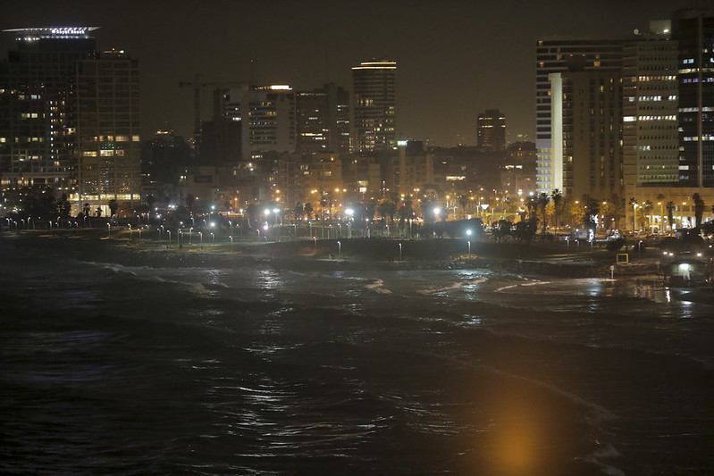

::: {.page-header style="background-image: url('../../assets/images/banners/news.jpg');"}
[News]{.page-header__title}

[&copy; [Anne Gärtner](https://www.gaertner-photo.de)]{.backimage-caption}
:::

::: {.content-section}
::: {.content-block}
::: {.profile-page}

::: {.profile-sidebar}
{.profile-avatar .detail-image}

::: {.pub-meta}
-  17.12.2018
-  TIE Team
-  Conference
:::

:::

::: {.profile-main}

This specialized AOM Conference took place in Tel Aviv from December 17 to 19, 2018 and was hosted by Hebrew University of Jerusalem, Technion-Israel Institute of Technology, and Tel Aviv University in collaboration with the AOM Divisions & Interest Groups. Christoph Ihl participated in this great event.

:::

:::
:::
:::
