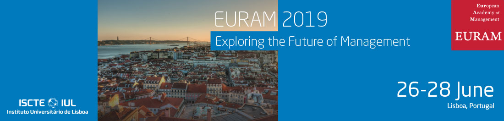

::: {.page-header style="background-image: url('../../assets/images/banners/news.jpg');"}
[News]{.page-header__title}

[&copy; [Anne Gärtner](https://www.gaertner-photo.de)]{.backimage-caption}
:::

::: {.content-section}
::: {.content-block}
::: {.profile-page}

::: {.profile-sidebar}
{.profile-avatar .detail-image}

::: {.pub-meta}
-  26.06.2019
-  TIE Team
-  Conference
:::

:::

::: {.profile-main}

Our Institute was represented by Christoph Ihl, Hannes Lampe and Dimitri Graf.

:::

:::
:::
:::
