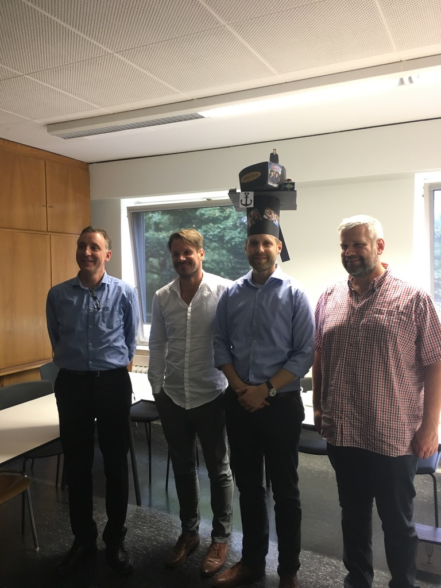

::: {.page-header style="background-image: url('../../assets/images/banners/news.jpg');"}
[News]{.page-header__title}

[&copy; [Anne Gärtner](https://www.gaertner-photo.de)]{.backimage-caption}
:::

::: {.content-section}
::: {.content-block}
::: {.profile-page}

::: {.profile-sidebar}
{.profile-avatar .detail-image}

::: {.pub-meta}
-  01.06.2019
-  TIE Team
-  PhD Thesis
:::

:::

::: {.profile-main}

This dissertation examines how the structure of social networks affects entrepreneurial entry. It analyses the effects of social influence and status on individuals' decision to launch a new, self-generated offering. Previous works have demonstrated these effects, but have not yet been able to uncover the underlying mechanisms. Based on network theory, we derive hypotheses about proximity-based contagion and status-based convergence mechanisms and test them in the context of the comics industry with event analyses and panel data mapping the careers of more than 11,000 creators from 1988 to 2014.

Examiners: Prof. Dr. Christoph Ihl and Prof. Dr. Alexander Vossen

Day of Oral Doctoral Examination: 21.06.2019

:::

:::
:::
:::
