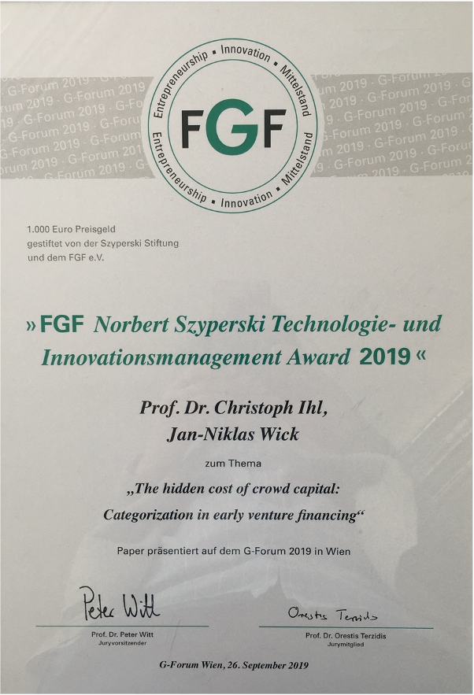

::: {.page-header style="background-image: url('../../assets/images/banners/news.jpg');"}
[News]{.page-header__title}

[&copy; [Anne Gärtner](https://www.gaertner-photo.de)]{.backimage-caption}
:::

::: {.content-section}
::: {.content-block}
::: {.profile-page}

::: {.profile-sidebar}
{.profile-avatar .detail-image}

::: {.pub-meta}
-  25.09.2019
-  TIE Team
-  Conference
:::

:::

::: {.profile-main}

The 23rd Annual Interdisciplinary Conference on Entrepreneurship, Innovation and SMEs was held in Vienna from September 25th to 27th, 2019. Lead partner of the FGF e.V. was the WU Vienna University of Economics, Institute for SME Management and Entrepreneurship represented by Prof. Dr. Dietmar Roessl, who together with PD Dr. Alexander Kessler represented the presidency of the conference.

The overarching theme of the G-Forum 2019 in Vienna was: "Opportunities for SMEs in a globalized world".

Christoph Ihl and Jan Niklas Wick received the FGF Norbert Szyperski Technology and Innovation Management Award 2019.

:::

:::
:::
:::
