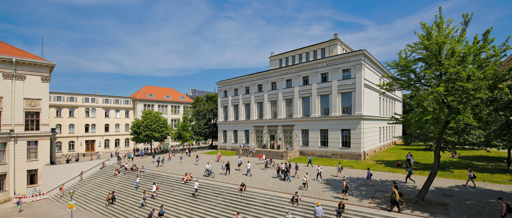

::: {.page-header style="background-image: url('../../assets/images/banners/news.jpg');"}
[News]{.page-header__title}

[&copy; [Anne Gärtner](https://www.gaertner-photo.de)]{.backimage-caption}
:::

::: {.content-section}
::: {.content-block}
::: {.profile-page}

::: {.profile-sidebar}
{.profile-avatar .detail-image}

::: {.pub-meta}
-  28.11.2019
-  TIE Team
-  Conference
:::

:::

::: {.profile-main}

The 14th Conference on Innovation and Value Creation took place at Martin-Luther-Universität in Halle-Wittenberg from November 28 to 30, 2019.

All of our researchers together with Christoph Ihl participated in this colloquium, exchanging and discussing recent research results. Every year, members of renowned universities with research backgrounds in innovation management, entrepreneurship, organization and workplace design, information systems, and public policy meet in this community.

:::

:::
:::
:::
