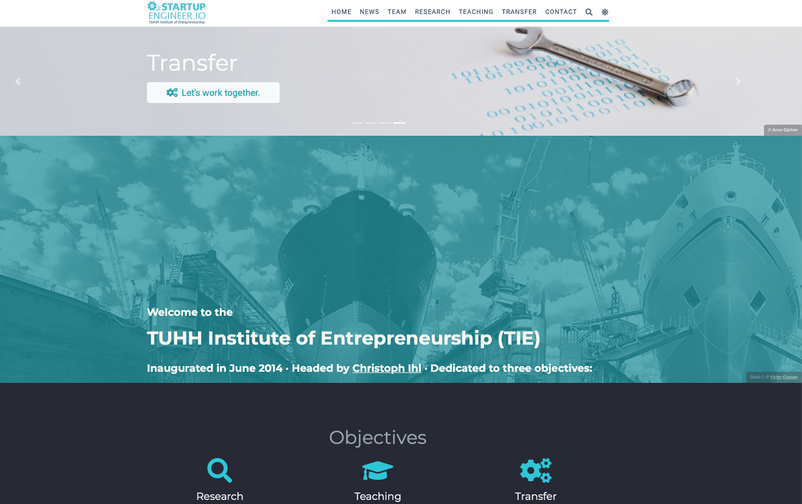

::: {.page-header style="background-image: url('../../assets/images/banners/news.jpg');"}
[News]{.page-header__title}

[&copy; [Anne Gärtner](https://www.gaertner-photo.de)]{.backimage-caption}
:::

::: {.content-section}
::: {.content-block}
::: {.profile-page}

::: {.profile-sidebar}
{.profile-avatar .detail-image}

::: {.pub-meta}
-  05.04.2020
-  Christoph Ihl
-  Announcement
:::

:::

::: {.profile-main}

We have just launched our new institute website created with the tools we love: [RStudio](https://www.rstudio.com) and [R](https://cran.r-project.org/), especially using the [blogdown package](https://github.com/rstudio/blogdown) in this case.

The website is using the beautiful [Academic theme](https://sourcethemes.com/academic) for [Hugo](https://gohugo.io) developed by [George Cushen](https://georgecushen.com).

The website is not entirely completed yet, especially the research page will be filled with content soon. Stay tuned for updates. The teaching page will be ready until the semester starts on April 20th.

Enjoy and comments welcome!

:::

:::
:::
:::
