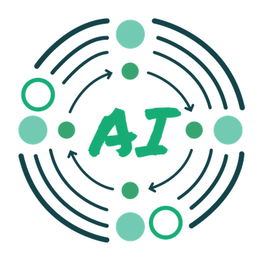

::: {.page-header style="background-image: url('../../assets/images/banners/news.jpg');"}
[News]{.page-header__title}

[&copy; [Anne Gärtner](https://www.gaertner-photo.de)]{.backimage-caption}
:::

::: {.content-section}
::: {.content-block}
::: {.profile-page}

::: {.profile-sidebar}
{.profile-avatar .detail-image}

::: {.pub-meta}
-  17.05.2025
-  Oliver Specht
-  Research Project
:::

:::

::: {.profile-main}

The **AI-InnoScEnCE** project — *AI-Empowered Innovation in Natural Science and Engineering for the Circular Economy* — has successfully entered its first implementation phase. The initiative brings together universities, research institutes, and industry partners from across Europe to strengthen innovation capacity and future-proof the talent pipeline in the emerging circular economy.

Launched in **April 2025** under the EIT Higher Education Initiative, AI-InnoScEnCE aims to empower higher education institutions to become engines of sustainable innovation. The consortium focuses on building new competences in *AI-enabled innovation processes*, *entrepreneurship support*, and *science–industry collaboration* to generate measurable impact in regional and European innovation ecosystems.

### Key objectives of the project include:
- **Strengthening institutional innovation capacity** through new structures, services, and cross-institutional cooperation.
- **Developing talent for the circular economy**, including students, researchers, academic staff, and professionals.
- **Integrating AI methods** into innovation, entrepreneurship, and industry collaboration workflows.
- **Supporting start-ups and SMEs** with training, mentoring, and access to innovation infrastructures.
- **Creating opportunities for sustainable value creation**, with a specific focus on circularity and responsible innovation.

During the first months, partners have begun developing **AI-supported training formats**, establishing **interdisciplinary collaboration practices**, and preparing joint activities with regional stakeholders. These efforts follow the project's mission to accelerate knowledge transfer and strengthen Europe's ability to innovate in the transition toward circular and sustainable economic systems.

AI-InnoScEnCE is coordinated by a strong international consortium representing multiple countries and disciplines, reinforcing the project's ambition to build long-term institutional capacity and lay the groundwork for a resilient European innovation landscape.

Further updates, project activities, and news are available at [ai-innoscence.eu](https://ai-innoscence.eu/).

:::

:::
:::
:::
