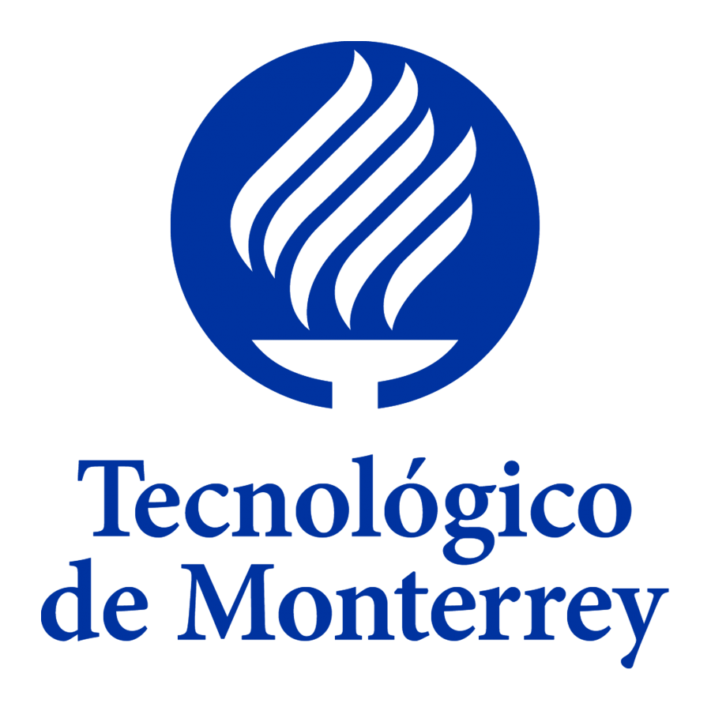
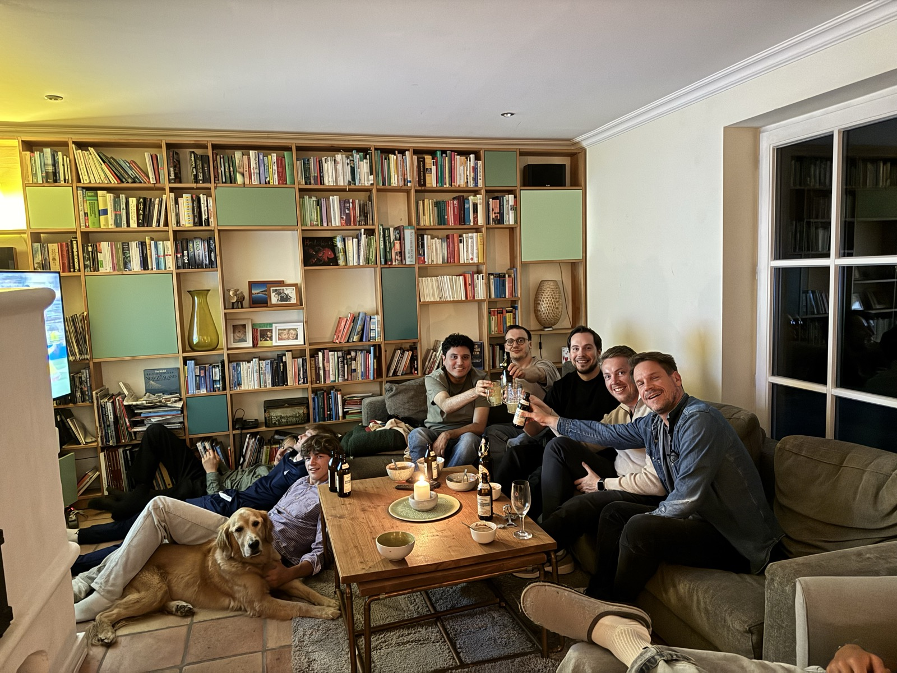

::: {.page-header style="background-image: url('../../assets/images/banners/news.jpg');"}
[News]{.page-header__title}

[&copy; [Anne Gärtner](https://www.gaertner-photo.de)]{.backimage-caption}
:::

::: {.content-section}
::: {.content-block}
::: {.profile-page}

::: {.profile-sidebar}
{.profile-avatar .detail-image}

::: {.pub-meta}
-  06.07.2026
-  TIE Team
-  Research Visit
:::

:::

::: {.profile-main}

From 6 June to 6 July 2026, we were happy to welcome **Daniel Zavala Salazar** from [Tecnológico de Monterrey](https://tec.mx/en), Mexico, as a visiting researcher at our institute. Daniel is a PhD candidate in Engineering Science and also teaches at Tecnológico de Monterrey. His research focuses on the entrepreneurial strategies of academic spin-offs — a topic closely connected to our own work on technology entrepreneurship and science-based ventures.

During his month in Hamburg, Daniel presented his research in a collaborative research session that sparked lively discussions. Drawing on our own research, experience, and resources, we then developed new ideas together to take his project further. To experience Hamburg's ecosystem for academic spin-offs first-hand, we also visited [TUTECH](https://www.tutech.de), the technology transfer company of TUHH, as well as Impossible Founders, Hamburg's startup factory for science-based deep tech ventures, at their space in HafenCity.

Beyond work, the visit coincided with the FIFA World Cup — so of course we got together to cheer on Mexico, starting with the tournament's opening match against South Africa on 11 June.

{fig-alt="The TIE team and Daniel Zavala Salazar watching a Mexico World Cup match together"}

We thank Daniel for the inspiring exchange and look forward to continuing our collaboration.

:::

:::
:::
:::
