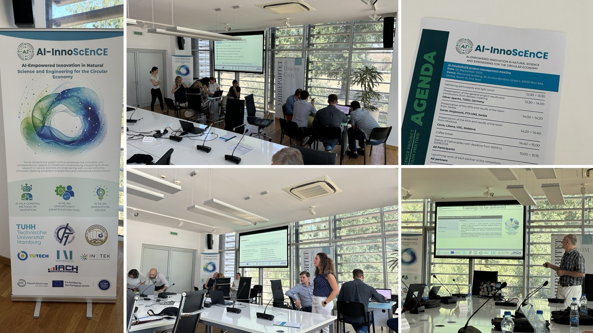

::: {.page-header style="background-image: url('../../assets/images/banners/news.jpg');"}
[News]{.page-header__title}

[&copy; [Anne Gärtner](https://www.gaertner-photo.de)]{.backimage-caption}
:::

::: {.content-section}
::: {.content-block}
::: {.profile-page}

::: {.profile-sidebar}
{.profile-avatar .detail-image}

::: {.pub-meta}
-  03.09.2026
-  TIE Team
-  Research Project
:::

:::

::: {.profile-main}

On 2 and 3 September 2026, the **AI-InnoScEnCE** consortium met for two days in Novi Sad, Serbia, hosted by Prof. Goran Stojanović and his team from the Faculty of Technical Sciences at the University of Novi Sad.

The first day was dedicated to project management. [Oliver Specht](/team/specht/) from our institute opened with an overview of the overall project results and the conclusions of the recent review meeting. The teams from Serbia and Moldova then presented their KPIs and results, before the partners reviewed the status of recent deliverables and discussed each partner's upcoming work. The day ended with a visit to the host's laboratories and a joint dinner.

On the second day, the consortium held its second **Stakeholder Engagement Workshop**, moderated by Chema Abdennadher and Jelena Petrović. Participants saw a demonstration of the updated mapping tool, validated the mapping results together, and explored new opportunities for cross-regional collaboration. The workshop closed with joint action planning and input for the project roadmap.

We thank our colleagues in Novi Sad for their warm hospitality and two productive days. Learn more about the project at [ai-innoscence.eu](https://ai-innoscence.eu/).

:::

:::
:::
:::
