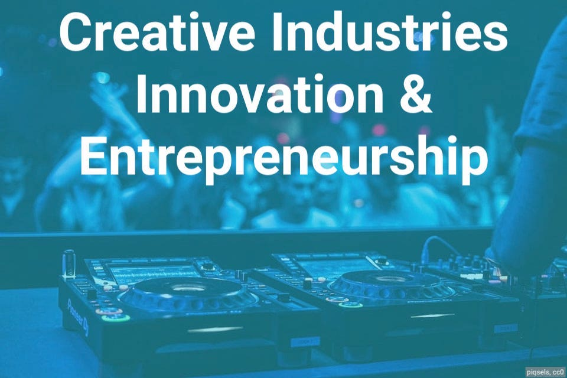
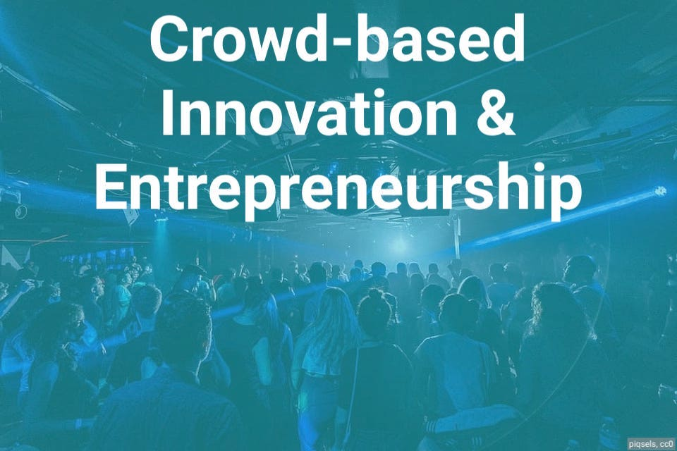

::: {.page-header style="background-image: url('assets/images/banners/research.jpg');"}
[Research]{.page-header__title}

[&copy; [Anne Gärtner](https://www.gaertner-photo.de)]{.backimage-caption}
:::

::: {.content-section}
::: {.content-block}

## Focus & Fields {.section-heading}

Our research about innovation and entrepreneurship lies at the intersection of organizational theory, sociology and strategy. In particular, we are interested in how actors are influenced by and interact with their social and cultural environments to bring about novelty, e.g. with regard to ideas, teams, products or business practices. Our theoretical explanations are based on mechanisms such as social influence, diffusion, status, legitimacy, optimal distinctiveness, social evaluation, cognition, social capital.

Our research is situated in domains where social and cultural spaces can be measured (more or less) comprehensively, e.g. based on relations with other actors or associations with concepts and narratives.
In order to position actors in these spaces and categorize them as "novel" or "atypical", we employ methods from computational social science such as machine learning, natural language processing and network analysis.

The empirical phenomena we are interested in broadly fall into one of these fields:

::: {.research-fields-grid}





:::

:::
:::

::: {.content-section-alt}
::: {.content-block}

## Projects {.section-heading}

::: {#project-listing}
:::

:::
:::

::: {.content-section}
::: {.content-block}

## Publications {.section-heading}

::: {#pub-listing}
:::

```{=html}
<div style="text-align: center; margin-top: 2rem;">
  <button id="show-more-pubs" class="btn-tuhh" style="cursor: pointer;">SHOW MORE</button>
</div>
<script>
document.addEventListener("DOMContentLoaded", function() {
  // Hide Quarto's default pagination
  var pag = document.getElementById("pub-listing-pagination");
  if (pag) pag.style.display = "none";

  var btn = document.getElementById("show-more-pubs");
  var pageSize = 20;

  function updateButton() {
    var list = window['quarto-listings'] && window['quarto-listings']['listing-pub-listing'];
    if (!list) return;
    var total = list.matchingItems.length;
    if (pageSize >= total) {
      btn.style.display = "none";
    } else {
      btn.style.display = "inline-block";
    }
  }

  btn.addEventListener("click", function() {
    var list = window['quarto-listings'] && window['quarto-listings']['listing-pub-listing'];
    if (!list) return;
    pageSize += 20;
    list.page = pageSize;
    list.update();
    list.show(1, pageSize);
    updateButton();
  });

  // Initial check after listing loads
  var origLoaded = window['quarto-listing-loaded'];
  window['quarto-listing-loaded'] = function() {
    if (origLoaded) origLoaded();
    updateButton();
  };
  // Also check immediately in case listing already loaded
  setTimeout(updateButton, 200);
});
</script>
```

:::
:::
