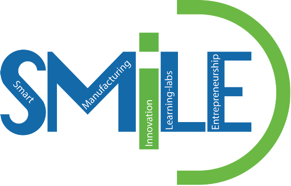
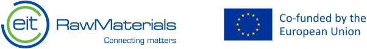

::: {.page-header style="background-image: url('../../../assets/images/banners/research.jpg');"}
[Research]{.page-header__title}

[&copy; [Anne Gärtner](https://www.gaertner-photo.de)]{.backimage-caption}
:::

::: {.content-section}
::: {.content-block}
::: {.profile-page}

::: {.profile-sidebar}
{.profile-avatar .detail-image}

::: {.pub-meta}
-  Smart Manufacturing
-  Deep Tech
-  Entrepreneurship Education
-  Innovation Ecosystems
-  Institutional Change
-  Learning Labs
:::

:::

::: {.profile-main}

## Abstract

**SMILE** (*Smart Manufacturing Innovation, Learning-labs, and Entrepreneurship*) is a multi-institutional European project funded under the **EIT Higher Education Initiative (HEI)**, led by Hamburg University of Technology. Smart manufacturing represents a cornerstone for economic competitiveness and growth, creating jobs and improving the quality of life of citizens. SMILE aims to accelerate institutional change and increase higher education institutions' innovation and entrepreneurship capacities as well as their integration into regional innovation ecosystems.

Building on the EIT knowledge triangle model — connecting research, education, and business — extended by civil society, SMILE develops and implements an Innovation Vision Action Plan comprising digital learning nuggets, learning labs, coaching, training, governance initiatives, and transferability actions. The project advances inclusion, gender equality, and the green and digital transition.

Over its two phases (July 2021 – July 2023), SMILE supported 13 start-ups, trained 735 students, 36 academic staff, and 41 non-academic staff members, and mentored 45 students across its partner network spanning Germany, Denmark, Italy, Ukraine, Albania, and Spain.

## Partners

- Hamburg University of Technology (Lead, Germany)
- AAU Innovation (Denmark)
- Agency of European Innovations, Lviv (Ukraine)
- GELLIFY srl (Italy)
- Politecnico di Milano (Italy)
- Synergeticon GmbH (Germany)
- Ternopil Ivan Pului National Technical University (Ukraine)

## Funding

:::

:::
:::
:::
