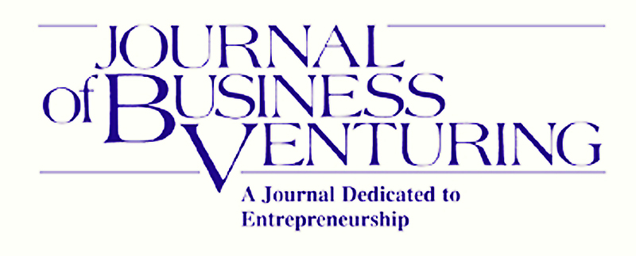

::: {.page-header style="background-image: url('../../../assets/images/banners/research.jpg');"}
[Research]{.page-header__title}

[&copy; [Anne Gärtner](https://www.gaertner-photo.de)]{.backimage-caption}
:::

::: {.content-section}
::: {.content-block}
::: {.profile-page}

::: {.profile-sidebar}
{.profile-avatar .detail-image}

::: {.pub-meta}
-  Journal Article
-  Journal of Business Venturing
-  2020
-  Vol. 35(6)
-  [DOI](https://doi.org/10.1016/j.jbusvent.2020.106050)
-  [Journal Website](https://www.sciencedirect.com/science/article/pii/S0883902620306583)
:::

:::

::: {.profile-main}

## Authors

Alexander Vossen, [Christoph Ihl](/team/ihl/)

## Abstract

Entrepreneurs face the challenge of having to conform to gain legitimacy, while at the same time differentiating themselves to gain competitive advantage. We show how entrepreneurs can craft an entrepreneurial narrative to succeed in this task among the user audiences empowered to evaluate their products.

## Tags

`Cultural Entrepreneurship` `Categories` `Narratives` `NLP`

## Citation

```bibtex
@article{vossen2020more,
  title     = {More than Words! How Narrative Anchoring and Enrichment Help to Balance Differentiation and Conformity of Entrepreneurial Products},
  author    = {Vossen, Alexander and Ihl, Christoph},
  journal   = {Journal of Business Venturing},
  volume    = {35},
  number    = {6},
  pages     = {106050},
  year      = {2020},
  doi       = {10.1016/j.jbusvent.2020.106050}
}
```

:::

:::
:::
:::
