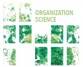

::: {.page-header style="background-image: url('../../../assets/images/banners/research.jpg');"}
[Research]{.page-header__title}

[&copy; [Anne Gärtner](https://www.gaertner-photo.de)]{.backimage-caption}
:::

::: {.content-section}
::: {.content-block}
::: {.profile-page}

::: {.profile-sidebar}
{.profile-avatar .detail-image}

::: {.pub-meta}
-  Journal Article
-  Organization Science
-  2023
-  Vol. 34(6), pp. 2097-2118
-  [DOI](https://doi.org/10.1287/orsc.2021.1520)
-  [PDF](https://pubsonline.informs.org/doi/pdf/10.1287/orsc.2021.1520)
-  [Open Access](https://pubsonline.informs.org/doi/full/10.1287/orsc.2021.1520)
-  [Code](https://osf.io/urjpe/)
-  [AEA RCT Registry](https://www.socialscienceregistry.org/trials/1179)
:::

:::

::: {.profile-main}

## Authors

[Viktoria Boss](/team/kessler/), Linus Dahlander, [Christoph Ihl](/team/ihl/), Rajshri Jayaraman

## Abstract

Scholars have suggested that autonomy can lead to better entrepreneurial team performance. Yet, there are different types of autonomy, and they come at a cost. We shed light on whether two fundamental organizational design choices—granting teams autonomy to (1) choose project ideas to work on and (2) choose team members to work with—affect performance. We run a field experiment involving 939 students in a lean startup entrepreneurship course over 11 weeks. The aim is to disentangle the separate and joint effects of granting autonomy over choosing teams and choosing ideas compared with a baseline treatment with preassigned ideas and team members. We find that teams with autonomy over choosing either ideas or team members outperform teams in the baseline treatment as measured by pitch deck performance. The effect of choosing ideas is significantly stronger than the effect of choosing teams. However, the performance gains vanish for teams that are granted full autonomy over choosing both ideas and teams. This suggests the two forms of autonomy are substitutes. Causal mediation analysis reveals that the main effects of choosing ideas or teams can be partly explained by a better match of ideas with team members' interests and prior network contacts among team members, respectively. Although homophily and lack of team diversity cannot explain the performance drop among teams with full autonomy, our results suggest that self-selected teams fall prey to overconfidence and complacency too early to fully exploit the potential of their chosen idea. We discuss the implications of these findings for research on organizational design, autonomy, and innovation.

## Tags

`Entrepreneurial Teams` `Field Experiment` `Autonomy` `Organizational Design`

## Citation

```bibtex
@article{boss2023organizing,
  title     = {Organizing Entrepreneurial Teams: A Field Experiment on Autonomy over Choosing Teams and Ideas},
  author    = {Boss, Viktoria and Dahlander, Linus and Ihl, Christoph and Jayaraman, Rajshri},
  journal   = {Organization Science},
  volume    = {34},
  number    = {6},
  pages     = {2097--2118},
  year      = {2023},
  doi       = {10.1287/orsc.2021.1520}
}
```

:::

:::
:::
:::
