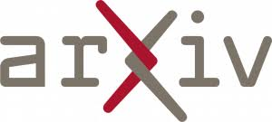

::: {.page-header style="background-image: url('../../../assets/images/banners/research.jpg');"}
[Research]{.page-header__title}

[&copy; [Anne Gärtner](https://www.gaertner-photo.de)]{.backimage-caption}
:::

::: {.content-section}
::: {.content-block}
::: {.profile-page}

::: {.profile-sidebar}
{.profile-avatar .detail-image}

::: {.pub-meta}
-  Working-Paper
-  2026
-  [DOI](https://doi.org/10.48550/arXiv.2603.03126)
-  [PDF](https://arxiv.org/pdf/2603.03126)
-  [Code](https://github.com/J0nasW/science-datalake)
-  [Dataset](https://doi.org/10.57967/hf/7850)
:::

:::

::: {.profile-main}

## Authors

[Jonas Wilinski](/team/wilinski/)

## Abstract

Scholarly data are largely fragmented across siloed databases with divergent metadata and missing linkages among them. We present the Science Data Lake, a locally-deployable infrastructure built on DuckDB and simple Parquet files that unifies eight open sources - Semantic Scholar, OpenAlex, SciSciNet, Papers with Code, Retraction Watch, Reliance on Science, a preprint-to-published mapping, and Crossref - via DOI normalization while preserving source-level schemas. The resource comprises approximately 960GB of Parquet files spanning ~293 million uniquely identifiable papers across ~22 schemas and ~153 SQL views. An embedding-based ontology alignment using BGE-large sentence embeddings maps 4,516 OpenAlex topics to 13 scientific ontologies (~1.3 million terms), yielding 16,150 mappings covering 99.8% of topics (≥ 0.65 threshold) with F1 = 0.77 at the recommended ≥ 0.85 operating point, outperforming TF-IDF, BM25, and Jaro-Winkler baselines on a 300-pair gold-standard evaluation. We validate through 10 automated checks, cross-source citation agreement analysis (pairwise Pearson r = 0.76 - 0.87), and stratified manual annotation. Four vignettes demonstrate cross-source analyses infeasible with any single database. The resource is open source, deployable on a single drive or queryable remotely via HuggingFace, and includes structured documentation suitable for large language model (LLM) based research agents.

## Tags

`Scholarly Data` `Data Infrastructure` `Ontology Alignment` `Open Science`

:::

:::
:::
:::
