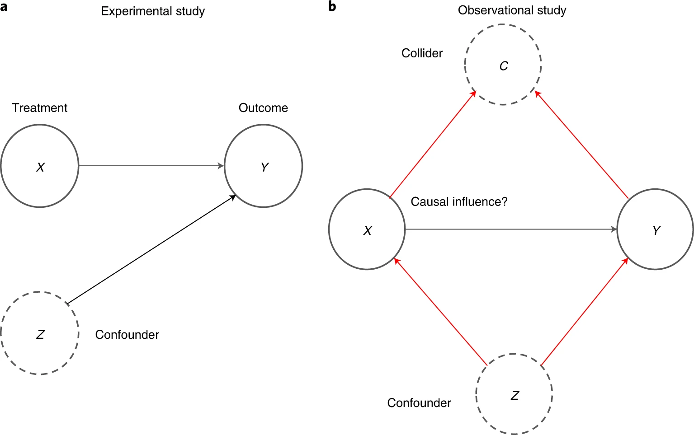

::: {.page-header style="background-image: url('../../../assets/images/banners/teaching.jpg');"}
[Teaching]{.page-header__title}

[&copy; [Anne Gärtner](https://www.gaertner-photo.de)]{.backimage-caption}
:::

::: {.content-section}
::: {.content-block}
::: {.profile-page}

::: {.profile-sidebar}
{.profile-avatar .detail-image}



:::

::: {.profile-main}

## Credits

-  ECTS module
- 2 courses: **Causal Data Science** (Lecture) & **Business Analytics with Causal Data Science** (Problem-based Learning)

## Instructors



## Overview

SHOWHIDE

Most managerial decision problems require answers to questions such as "what happens to Y if we do X?", or "was it X that caused Y to change?" In other words, practical business decision-making requires knowledge about cause-and-effect. While most data science and machine learning approaches are designed to efficiently detect patterns in high-dimensional data, they are not able to distinguish causal relationships from simple correlations. That means, commonly used approaches to business analytics often fall short to provide decision makers with important causal knowledge. Therefore, many leading companies currently try to develop specific causal data science capabilities.

This module will provide an introduction into the topic of causal inference with the help of modern data science and machine learning approaches and with a focus on applications to practical business problems from various management areas. Based on an overarching framework for causal data science, the course will guide students to detect sources of confounding influence factors, understand the problem of selective measurement in data collection, and extrapolate causal knowledge across different business contexts. We also cover several tools for causal inference, such as A/B testing and experiments, difference-in-differences, instrumental variables, matching, regression discontinuity designs, etc. A variety of hands-on examples will be discussed that allow students to apply their newly obtained knowledge and carry out state-of-the-art causal analyses by themselves.

## Objectives

SHOWHIDE

After completing this module, students will be able to:

- Understand the difference between "correlation" and "causation"
- Understand the shortcomings of current correlation-based approaches
- Develop causal knowledge relevant for specific data-driven decisions
- Formalize intuition about causal relationships using a "language" of causality
- Derive causal hypotheses that can be tested with data
- Discuss the conceptual ideas behind state-of-the-art causal data science tools and algorithms
- Carry out causal data analyses with state-of-the-art tools

## Grading

- Five assignments, one referring to each part, each counting **20%**.

## Target Audience

- Master students in "Data Science" and "Internationales Wirtschaftsingenieurwesen (IWI)"
- Students with a strong interest and motivation in acquiring the skills required for mastering the causal aspects of modern business analytics.

## Registration

Please register for the entire module **** here: [E-Learning StudIP]()

## Time & Location



### Course Notes & Materials

Access to course notes & materials [**here**]().

## Preliminary Schedule

| Session | Topic | Date |
| --- | --- | --- |
| 1 | Introduction to Causal Inference | April 13 & 14 |
| **Part 1** | **Graphical Causal Models** |  |
| 2 | Graphical Causal Models | April 20 & 21 |
| 3 | Causal Discovery | April 27 & 28 |
| **Part 2** | **Experiments** |  |
| 4 | Experiments & Linear Regression | May 4 & 5 |
| 5 | Online A/B-Testing | May 18 & 19 |
| **Part 3** | **Un-/Observed Confounding** |  |
| 6 | Observed Confounding | June 1 & 2 |
| 7 | Instrumental Variable Designs | June 8 & 9 |
| **Part 4** | **Causal Machine Learning** |  |
| 9 | Double Machine Learning | June 15 & 16 |
| 10 | Treatment Effect Heterogeneity | June 22 & 23 |
| **Part 5** | **Causal Panel Data** |  |
| 11 | Difference-in-Differences | June 29 & 30 |
| 12 | Synthetic Controls | July 6 & 7 |
| 13 | Counterfactual Imputation | July 14 & 14 |

## Literature

**Primary**

- Ding, Peng (2023). A First Course in Causal Inference. arXiv preprint arXiv:2305.18793.
- Facure, Matheus (2023). Causal Inference in Python — Applying Causal Inference in the Tech Industry. O'Reilly Media.
- Huber, Martin (2023). Causal analysis: Impact evaluation and Causal Machine Learning with applications in R. MIT Press.
- Neal, Brady (2020). Introduction to causal inference from a Machine Learning Perspective. Course Lecture Notes (draft).

**Secondary**

- Angrist, J. D., & Pischke, J. S. (2014). Mastering metrics: The path from cause to effect. Princeton University Press.
- Cunningham, Scott (2021). Causal Inference: The Mixtape. Yale University Press.
- Gertler, Paul J., et al. (2016). Impact evaluation in practice. World Bank Publications.
- Hernán, Miguel A., and Robins, James M. (2020). Causal Inference: What If. Chapman & Hall/CRC.
- Huntington-Klein, Nick (2021). The effect: An introduction to research design and causality. Chapman and Hall/CRC.
- Imbens, G. W., & Rubin, D. B. (2015). Causal inference in statistics, social, and biomedical sciences. Cambridge University Press.
- Mullainathan, Sendhil, and Jann Spiess (2017). Machine Learning: An Applied Econometric Approach. Journal of Economic Perspectives, 31(2): 87–106.
- Pearl, Judea, and Dana Mackenzie (2018). The Book of Why. Basic Books. 
- Pearl, Judea, Madelyn Glymour, and Nicholas P. Jewell (2016). Causal Inference in Statistics: A Primer. Wiley.
- Peters, Jonas, Dominik Janzing, and Bernhard Schölkopf (2017). Elements of causal inference: foundations and learning algorithms. MIT Press.

:::

:::
:::
:::
