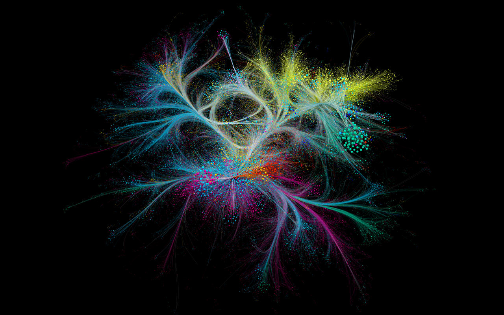

::: {.page-header style="background-image: url('../../../assets/images/banners/teaching.jpg');"}
[Teaching]{.page-header__title}

[&copy; [Anne Gärtner](https://www.gaertner-photo.de)]{.backimage-caption}
:::

::: {.content-section}
::: {.content-block}
::: {.profile-page}

::: {.profile-sidebar}
{.profile-avatar .detail-image}



:::

::: {.profile-main}

## Credits

-  ECTS module
- 2 courses: **Deep Learning for Text and Graphs** (Lecture) & **Social Analytics with Deep Learning** (Problem-based Learning)

## Instructors



## Overview

SHOWHIDE

**Social analytics** broadly refers to measuring, modeling, visualizing and interpreting interactions between actors (e.g. organizations, firms, employees, customers, users, scientists, citizens or politicians) and their connections with objects (e.g. topics, opinions, categories, concepts, products, or ideas). Data about these interactions and connections are available in ever greater detail and quantity from diverse digital sources, with social media platforms being just one of them.

The discourse and debates about current societal issues can be monitored from digitized news archives. Organizations speak about their positioning and partners via their websites. Firms solicit feedback from customers via online forums and track their interactions with products. In diverse fields such as sports, culture, and art, as well as science, technology, and software development, dedicated online communities or (user-generated) data archives keep track of historical interactions and connections among actors and objects.

Tapping into these kinds of data sources for social analytics allows public and private decision makers, among other things, to work towards the following goals: (1) detecting emerging trends, (2) tracking prevalent opinions over time, (3) identifying influential actors, (4) understanding the diffusion of certain objects, (5) supporting or preventing certain social interactions, (6) finding matching collaboration partners, (7) discovering novel ideas, (8) gathering competitive intelligence, or (9) generating product recommendations.

Relevant data on interactions and connections among actors and objects is often embodied in text and/or needs to be converted into graphs. Therefore, the course introduces the fundamentals and current state of machine learning for unstructured text and graph data. The course has a particular emphasis on recent advancements in deep learning architectures. Through lectures and coding labs using the deep learning framework PyTorch, students will learn the necessary skills to design, implement, and understand their own deep learning pipelines with respect to specific social analytics goals.

## Objectives

SHOWHIDE

After completing this module, students will be able to:

- Understand and describe the role of social interactions and networks for the development of specific domains.
- Gather, pre-process and visualize social data.
- Understand and apply deep learning techniques to text and graph data.
- Engage in a complex analysis project to deliver concise and actionable insights.

## Grading

- **50%** (individual): Five assignments, one referring to each part, each counting 10%.
- **50%** (team): Teams of 3 students work on a joint research project of their choice (submission deadline: March 31).

## Target Audience

- Master students in "Data Science" and "Internationales Wirtschaftsingenieurwesen (IWI)"
- Students with a strong interest and motivation in acquiring the quantitative skills required to analyze social phenomena of importance to organizations, businesses and policy makers.

## Registration

- Please register for the entire module **** here: [E-Learning StudIP]()
- Due to the PBL and project-based nature of the module, we have to limit the number of participants to a max of 30 students.
- In case of over-demand, access to the course will be granted based on the quality of a brief research proposal to be submitted after the first class.

## Time & Location



### Course Notes & Materials

Access to course notes & materials [**here**]().

## Preliminary Schedule

| Session | Topic | Date |
| --- | --- | --- |
| **Part 1** | **NLP Building Blocks** |  |
| 1 | Tokens & Embeddings | October 16 |
| 2 | RNNs & LSTMs | October 23 |
| **Part 2** | **LLM Building Blocks** |  |
| 3 | Large Language Models | October 30 |
| 4 | Transformers | November 6 |
| **Part 3** | **Post-/Training LLMs** |  |
| 5 | Training | November 13 |
| 6 | Finetuning | November 20 |
| **Part 4** | **Using LLMs** |  |
| 7 | Text Classification, Clustering & Extraction | November 27 |
| 8 | Semantic Search and RAG | December 4 |
| **Part 5** | **Deep Learning on Graphs** |  |
| 9 | Graph Embeddings | December 11 |
| 10 | Graph Neural Networks | December 18 |
| **Part 6** | **Team Projects** |  |
| 11 | Project Lab | January 8 |
| 12 | Project Lab | January 15 |
| 13 | Project Lab | January 22 |
| 14 | Project Pitches | January 29 |
|  | Project Submission: Final Upload of all Files (Report & Code) | February 19 |

## Literature

- Alammar, J., & Grootendorst, M. (2024). Hands-on large language models: language understanding and generation. O'Reilly Media.
- Barabasi, A. L. (2016). Network Science. Cambridge University Press.
- Hamilton, W. L. (2020). Graph Representation Learning. Synthesis Lectures on Artificial Intelligence and Machine Learning, Vol. 14, No. 3, Pages 1–159.
- Jurafsky, D., & Martin, J. H. (2025). Speech and Language Processing: An Introduction to Natural Language Processing, Computational Linguistics, and Speech Recognition, with Language Models.
- Ma, Y., & Tang, J. (2021). Deep learning on graphs. Cambridge University Press.
- Rao, D., & McMahan, B. (2019). Natural language processing with PyTorch: build intelligent language applications using deep learning. O'Reilly Media.
- Tunstall, L., Von Werra, L., & Wolf, T. (2022). Natural language processing with transformers. O'Reilly Media.

:::

:::
:::
:::
