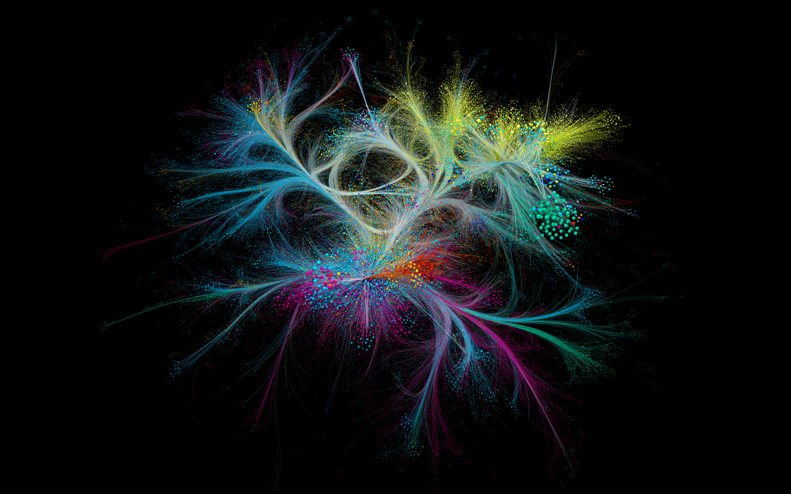

::: {.page-header style="background-image: url('../../../assets/images/banners/teaching.jpg');"}
[Teaching]{.page-header__title}

[&copy; [Anne Gärtner](https://www.gaertner-photo.de)]{.backimage-caption}
:::

::: {.content-section}
::: {.content-block}
::: {.profile-page}

::: {.profile-sidebar}
::: {.image-credit-wrapper}
{.profile-avatar .detail-image}

[&copy; [BarabásiLab](https://www.barabasilab.com)]{.image-credit}
:::



:::

::: {.profile-main}

## Credits

-  ECTS module
- 2 courses: **Deep Learning for Text and Graphs** (Lecture) & **Social Analytics with Deep Learning** (Problem-based Learning)

## Instructors



## Overview

SHOWHIDE

**Social analytics** examines how people, organizations, institutions and other actors interact with one another and with objects such as ideas, technologies, products, occupations and opinions. Across many domains, the resulting digital traces can help public and private decision-makers detect emerging developments, understand diffusion and concentration, identify overlooked matches or opportunities, and determine where closer investigation may be warranted. Producing credible evidence, however, requires more than applying a model: social meaning is often embedded in unstructured text, while interactions must be reconstructed and analyzed as networks.

This course focuses that broad agenda on the **production, diffusion and commercialization of science and technology**. It examines different windows onto this process: how knowledge develops through science, how inventions are organized into technological fields, how people and skills move through organizations, and how new ventures connect with investors. These domains are not treated as a frictionless pipeline. Instead, they reveal recurring problems of measurement, classification, matching, prediction and data linkage across complex social systems.

Three commitments shape the course:

- **Measurement before modeling.** Administrative categories, human annotations and LLM outputs are measurements, not ground truth. Their provenance, stability and error must be understood before they are used in downstream analysis.
- **Text and relationships together.** Text captures what actors and objects are about; graphs represent who is connected to whom, and when. Retrieval, relational recommendation, graph learning and text-attributed graphs provide complementary views of the same social systems.
- **Evaluation before claims.** Models and agents are evaluated against strong baselines, realistic candidate sets, temporal splits, cold-start cases and auditable traces. Predictive performance alone does not establish influence, causal mechanisms or the value of acting on a recommendation.

The course is **Python throughout**, with PyTorch and PyTorch Geometric where the model warrants it. Students implement pipelines rather than only calling them, and apply them across four data tracks:

- **Scientific publications** — connecting authors, papers, venues and research topics
- **Workforce** — relating workers, skills and firms
- **Patents** — tracing inventors, assignees and technological fields
- **Startup financing** — connecting investors with new ventures

For each assignment, students may switch tracks to explore another domain or stay with one track to specialize. The capstone brings at least two tracks together using supplied cross-source linkage tables. Each week pairs a 90-minute lecture with a 135-minute problem-based learning session.

## Objectives

SHOWHIDE

Upon completion of this course, students will be able to:

1. Turn a social question into a prediction task with a defensible construct and baseline
2. Represent text and social structure using modern deep learning architectures
3. Obtain labels under scarcity by prompting, fine-tuning or classifying embeddings
4. Validate LLM-derived measures and quantify their error
5. Carry measurement error correctly into downstream statistical inference
6. Discover and validate latent structure in text against external taxonomies
7. Construct social graphs with an explicit boundary and model them with GNNs
8. Evaluate relational predictions honestly under temporal splits
9. Explain why predictive results do not identify influence or separate it from homophily, and state what research design an influence claim would require
10. Build and evaluate models over linked heterogeneous data sources, including sensitivity to missing or uncertain cross-source links

## Grading

- **60%** (individual): Four assignments (15% each), submitted as rendered Quarto reports with integrated Python code. Each assignment is followed by a short in-class quiz; students must score at least 50% to receive their full report grade (otherwise the assignment grade is capped at 60%). Due dates: 8 November, 29 November and 13 December 2026, and 10 January 2027.
- **40%** (team): Capstone project in teams of up to 3 students, combining at least two linked data tracks — assessed through a proposal (due 17 January 2027), an in-class presentation (28 January 2027) and a final written report (due 15 March 2027).

All submissions are due at 23:59. Late submissions of up to 24 hours receive a 20% penalty; later submissions are not accepted.

## Target Audience

- Master students in Data Science, Computer Science & IWI
- Master students with a strong interest in computational social science

## Registration

- Please register for the entire module **** here: [E-Learning StudIP]()
- Due to the PBL and project-based nature of the module, we have to limit the number of participants to a max of 30 students.
- In case of over-demand, access to the course will be granted based on the quality of a brief research proposal to be submitted after the first class.

## Time & Location



The lecture period runs from **15 October 2026** to **28 January 2027**. There is no class on 12 November, 24 December and 31 December 2026.

### Course Notes & Materials

Access to course notes & materials [**here**]().

## Preliminary Schedule

| Session | Topic | Date |
| --- | --- | --- |
| 1 | Social Questions, Constructs, and Evaluation | October 15 |
| **Part I** | **Text Representation** | |
| 2 | Tokens, Embeddings, and Semantic Geometry | October 22 |
| 3 | Transformers and Pretraining | October 29 |
| **Part II** | **Measurement with LLMs** | |
| 4 | Supervised Text Modeling with Scarce Labels | November 5 |
| 5 | Measurement Error and Valid Inference | November 19 |
| **Part III** | **Retrieval and Structure Discovery** | |
| 6 | Retrieval and Semantic Similarity | November 26 |
| 7 | Clustering, Topic Discovery, and Knowledge Graphs | December 3 |
| **Part IV** | **Graph Learning** | |
| 8 | Bipartite Graphs and Relational Recommender Systems | December 10 |
| 9 | Graph Neural Networks | December 17 |
| **Part V** | **Integrated and Agentic Modeling** | |
| 10 | Integrated Modeling with Text-Attributed Graphs | January 7 |
| 11 | LLM Agents for Social Analytics | January 14 |
| — | Consultation Week (Office Hours) | January 21 |
| — | Capstone Presentations | January 28 |
|  | Capstone Submission: Final Report | March 15 |

:::

:::
:::
:::
