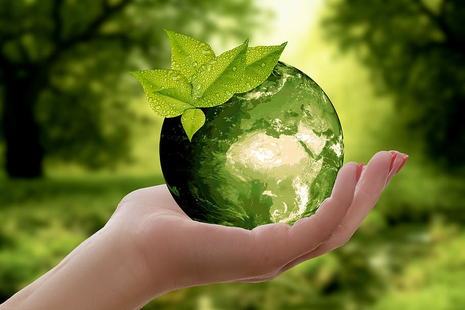

::: {.page-header style="background-image: url('../../../assets/images/banners/teaching.jpg');"}
[Teaching]{.page-header__title}

[&copy; [Anne Gärtner](https://www.gaertner-photo.de)]{.backimage-caption}
:::

::: {.content-section}
::: {.content-block}
::: {.profile-page}

::: {.profile-sidebar}
{.profile-avatar .detail-image}

::: {.pub-meta}
-  Master Thesis
-  Open
-  [Jürgen Thiesen](/team/thiesen/)
:::

:::

::: {.profile-main}

## Overview

Join our research group at the intersection of Management Science and Deep Learning to investigate critical questions in clean technologies, green innovation, and circular economy transitions. We offer flexible thesis opportunities to pursue your interests using diverse methodological approaches (quantitative, e.g. Deep Learning or NLP, or qualitative, e.g. interviews or literature reviews) and comprehensive datasets (e.g., patent data, scientific publications, startup databases).

## Potential Key Focus Areas

- **Technology emergence and novelty** detection in sustainable innovations
- **Diffusion patterns and commercialization** of clean technologies
- **Circular economy transformation** through technological innovation
- **Data-driven analysis** using PATSTAT, OpenAlex, and startup databases
- **NLP/Deep Learning or qualitative methods** (interviews, literature reviews)

## Ideal For

Students with backgrounds in management, computer science, data science, engineering, or sustainability studies with strong analytical interests and passion for the green transition.

:::

:::
:::
:::
