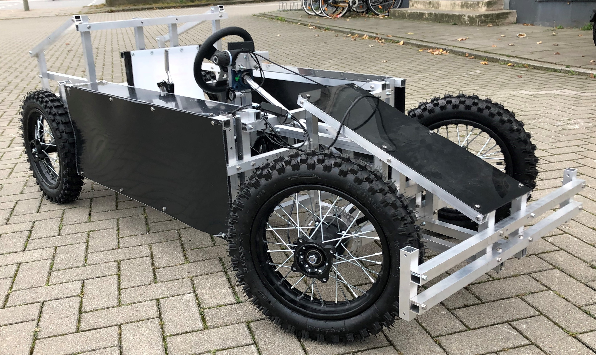

::: {.page-header style="background-image: url('../../../assets/images/banners/teaching.jpg');"}
[Teaching]{.page-header__title}

[&copy; [Anne Gärtner](https://www.gaertner-photo.de)]{.backimage-caption}
:::

::: {.content-section}
::: {.content-block}
::: {.profile-page}

::: {.profile-sidebar}
{.profile-avatar .detail-image}

::: {.pub-meta}
-  Bachelor/Master Thesis
-  Completed
:::

:::

::: {.profile-main}

## Tasks

A young startup is developing a pedal electric car for children between 6–13 years. The vehicle drives up to 25 km/h and is equipped with several features, such as an aluminum space-frame, 7 gears, trunk, etc. Currently, they are finishing a second prototype and are about to begin intensive test driving. They are looking for an energetic student interested in helping develop their business plan.

### Subtasks

- Explore market and competition, potential customer segments, marketing channels, and potential revenue streams
- Work in close partnership with the founders team
- Gather and analyze data, potentially from customer interviews
- Determine and validate possible price points and willingness to pay
- Use findings to make recommendations to founders with regards to current prototype or business strategy

## Expectations

- Passion for business development and entrepreneurship
- Close partnership with founder team
- Hands-on mentality

:::

:::
:::
:::
