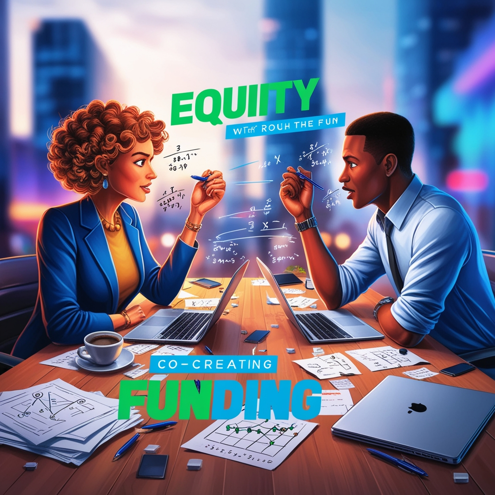

::: {.page-header style="background-image: url('../../../assets/images/banners/teaching.jpg');"}
[Teaching]{.page-header__title}

[&copy; [Anne Gärtner](https://www.gaertner-photo.de)]{.backimage-caption}
:::

::: {.content-section}
::: {.content-block}
::: {.profile-page}

::: {.profile-sidebar}
{.profile-avatar .detail-image}

::: {.pub-meta}
-  Master Thesis
-  Completed
-  [Oliver Specht](/team/specht/)
:::

:::

::: {.profile-main}

## Introduction

Opportunity identification (OI) is a fundamental process in innovation and strategic decision-making across various industries and fields. It enables businesses, policymakers, and other stakeholders to recognize areas for development, innovation, and value creation. Traditionally, OI has relied on expert-driven assessments, structured brainstorming sessions, and industry best practices. While valuable, they are often constrained by cognitive biases, siloed thinking, and a lack of real-time data integration — leading to missed opportunities and inefficiencies.

Recent advancements in artificial intelligence (AI) offer new possibilities for enhancing the OI process by providing intelligent, data-driven insights, facilitating stakeholder collaboration, and fostering creativity. AI-driven tools, such as machine learning algorithms, natural language processing, and generative AI models, can analyze vast amounts of data, identify patterns, and generate novel ideas that human teams might overlook. AI can also support real-time data integration, enabling stakeholders to make informed decisions based on the latest trends, technological advancements, and societal needs.

This master thesis aims to explore and understand AI-assisted OI processes by analyzing creativity workflows and stakeholder workshop scenarios. The research will focus on developing generalizable frameworks and methodologies for AI-assisted ideation and decision-making. The findings will be contextualized for the circular economy, providing insights into how AI-driven OI approaches can accelerate sustainable innovation.

## Research Objectives

- **Development and Analysis of OI Workshop Scenarios:** Design and evaluate different workshop scenarios involving diverse stakeholder groups, including industry representatives, policymakers, local businesses, researchers, and community members. The goal is to analyze how different stakeholder compositions influence the opportunity identification process and determine the most effective configurations for fostering innovation. In addition, the extent to which AI can support workshop scenarios, idea generation, and decision-making will be analyzed.
- **Comparative Study of Creativity Workflows:** A structured analysis of various creativity workflows used in OI will be conducted. Based on a literature review, OI standards, best practices, and methodologies such as design thinking, lateral thinking, and open innovation will be assessed for their effectiveness. The study will also examine how AI can support and enhance these workflows. The research will compare these workflows and propose a framework for integrating AI-driven ideation techniques into the OI process.

## Methodology

- **Literature Review:** A comprehensive review of creativity workflows, stakeholder engagement strategies, and AI applications in opportunity identification and circular economy innovation.
- **Design Thinking:** This user-centered methodology will be used to design and refine workshop scenarios and AI-assisted creativity workflows, involving iterative feedback loops with stakeholders.
- **Design Science Research (DSR):** A structured approach to developing and evaluating the AI-based assistant, involving problem identification, iterative design, prototype development, and evaluation.

## Expected Contributions

- A systematic comparison of creativity workflows for OI.
- A set of OI workshop scenarios with varying stakeholder compositions.
- An evaluation framework to assess the effectiveness of AI-assisted creativity workflows and stakeholder workshop scenarios in fostering opportunity identification.

:::

:::
:::
:::
