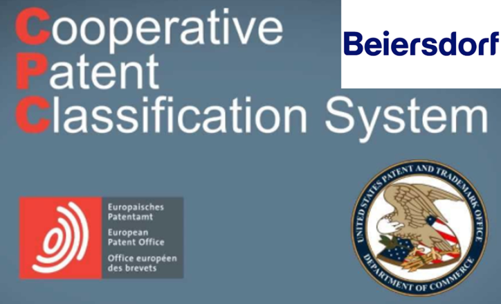

::: {.page-header style="background-image: url('../../../assets/images/banners/teaching.jpg');"}
[Teaching]{.page-header__title}

[&copy; [Anne Gärtner](https://www.gaertner-photo.de)]{.backimage-caption}
:::

::: {.content-section}
::: {.content-block}
::: {.profile-page}

::: {.profile-sidebar}
{.profile-avatar .detail-image}

::: {.pub-meta}
-  Master Thesis
-  Completed
-  [Beiersdorf](https://www.beiersdorf.de)
:::

:::

::: {.profile-main}

## Tasks

This thesis focuses on analyzing a patent dataset to predict and automate the classification process, which is currently carried out manually. The goal is to identify and test different machine learning algorithms to improve prediction accuracy. Features are derived from patent codes (e.g. IPC, CPC) and text data (e.g. patent claims, full text). A second classification task targets specific information (e.g. cosmetic substances) within the independent claims.

### Subtasks

- Preparation of patent data records and underlying text data
- Define and extract characteristics
- Training & testing various machine learning architectures
- Identify the best approach and fine tune hyperparameters

## Expectations

- Strong analytical skills and passion for data
- Willingness to cooperate with R&D of a leading global skin care company
- Very good knowledge of English
- Team player with an international mindset

**Ideally:**

- Skills in R or Python
- Experience in processing natural language
- Experience in machine learning

:::

:::
:::
:::
