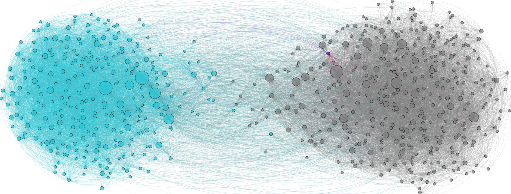

::: {.page-header style="background-image: url('../../../assets/images/banners/teaching.jpg');"}
[Teaching]{.page-header__title}

[&copy; [Anne Gärtner](https://www.gaertner-photo.de)]{.backimage-caption}
:::

::: {.content-section}
::: {.content-block}
::: {.profile-page}

::: {.profile-sidebar}
{.profile-avatar .detail-image}

::: {.pub-meta}
-  Master Thesis
-  Open
-  [Jonas Wilinski](/team/wilinski/)
:::

:::

::: {.profile-main}

## Overview

This thesis focuses on developing advanced NLP techniques to automatically generate comprehensive taxonomies for small, emerging research fields. You'll work with cutting-edge language models and contribute to the methodological advancement of research field analysis.

## Key Focus Areas

- **Advanced NLP techniques** for automated taxonomy generation
- **Analysis of existing taxonomy generation papers** and methodologies
- **Development of novel approaches** for small research field classification
- **Validation and benchmarking** of taxonomy quality metrics

## Ideal For

Students with a strong background in computer science, computational linguistics, or data science with interest in academic research and natural language processing.

:::

:::
:::
:::
