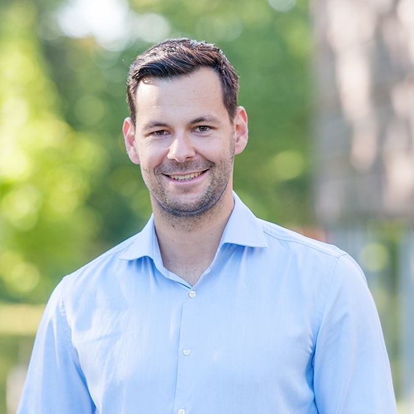

::: {.page-header style="background-image: url('../../assets/images/banners/team.jpg');"}
[Team]{.page-header__title}

[&copy; [Anne Gärtner](https://www.gaertner-photo.de)]{.backimage-caption}
:::

::: {.content-section}
::: {.content-block}
::: {.profile-page}

::: {.profile-sidebar}
{.profile-avatar}

::: {.profile-social}
[](https://de.linkedin.com/in/jan-frederik-arnold "LinkedIn")
:::

:::

::: {.profile-main}

## Biography

Venture Capital, Startup Distinctiveness, Social Evaluation

## Research Interests

::: {.profile-interests}
- Venture capital
- Startup atypicality
- Social evaluation
:::

## Appointments & Education

::: {.profile-education}
- [CEO]{.profile-education__position} [Flightright, Berlin, Germany]{.profile-education__institution} [2021 - current]{.profile-education__year}
- [CFO]{.profile-education__position} [Flightright, Berlin, Germany]{.profile-education__institution} [2019 - 2021]{.profile-education__year}
- [Engagement Manager]{.profile-education__position} [McKinsey & Company, Munich, Germany]{.profile-education__institution} [2012 - 2019]{.profile-education__year}
- [PhD in Management]{.profile-education__position} [Hamburg University of Technology, Germany]{.profile-education__institution} [2015 - 2018]{.profile-education__year}
- [MSc in Accounting and Finance]{.profile-education__position} [London School of Economics and Political Science, UK]{.profile-education__institution} [2010 - 2012]{.profile-education__year}
- [Bachelor of Arts in Business Administration]{.profile-education__position} [Universität St. Gallen, Switzerland]{.profile-education__institution} [2007 - 2010]{.profile-education__year}
:::

## Selected Publications

:::: {#selected-pubs}
::::

:::

:::
:::
:::
