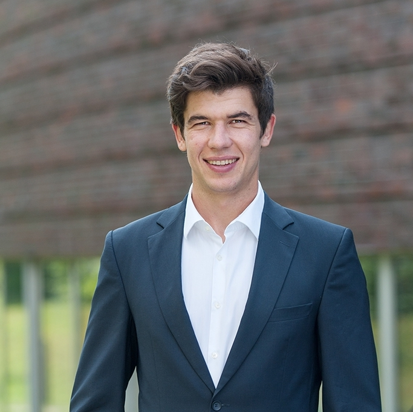

::: {.page-header style="background-image: url('../../assets/images/banners/team.jpg');"}
[Team]{.page-header__title}

[&copy; [Anne Gärtner](https://www.gaertner-photo.de)]{.backimage-caption}
:::

::: {.content-section}
::: {.content-block}
::: {.profile-page}

::: {.profile-sidebar}
{.profile-avatar}

::: {.profile-social}
[](https://www.linkedin.com/in/giulio-barth-00939039 "LinkedIn")
:::

:::

::: {.profile-main}

## Biography

Synthetic Biology, Open Source, Institutional Entrepreneurship

## Research Interests

::: {.profile-interests}
- Synthetic biology
- Open source
- Diffusion
- Institutional entrepreneurship
:::

## Appointments & Education

::: {.profile-education}
- [Consultant]{.profile-education__position} [McKinsey & Company, Munich, Germany]{.profile-education__institution} [2013 - current]{.profile-education__year}
- [Startup Consultant @ Startup Dock - Center for Entrepreneurship]{.profile-education__position} [Hamburg University of Technology, Germany]{.profile-education__institution} [2017 - 2018]{.profile-education__year}
- [PhD Summer School in Synthetic Biology]{.profile-education__position} [Stanford University, USA]{.profile-education__institution} [2016]{.profile-education__year}
- [PhD in Management]{.profile-education__position} [Hamburg University of Technology, Germany]{.profile-education__institution} [2015 - 2018]{.profile-education__year}
- [MSc in Industrial Engineering and Management]{.profile-education__position} [RWTH Aachen University, Germany]{.profile-education__institution} [2010 - 2012]{.profile-education__year}
- [Studies in Industrial Engineering and Management]{.profile-education__position} [Politecnico di Milano, Italy]{.profile-education__institution} [2009 - 2010]{.profile-education__year}
- [BSc in Industrial Engineering and Management]{.profile-education__position} [RWTH Aachen University, Germany]{.profile-education__institution} [2006 - 2009]{.profile-education__year}
:::

## Selected Publications

:::: {#selected-pubs}
::::

:::

:::
:::
:::
