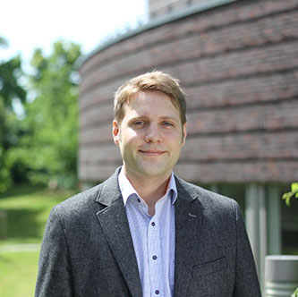

::: {.content-section}
::: {.content-block}
::: {.profile-page}

::: {.profile-sidebar}
{.profile-avatar}

### Dr. Michael Engel {.profile-name}

[Research Assistant & Doctoral Student]{.profile-role}

::: {.profile-social}
[](https://de.linkedin.com/in/m-engel "LinkedIn")
:::

:::

::: {.profile-main}

## Biography

Transition to entrepreneurship, status, peer influence

## Interests

::: {.profile-interests}
- Transition to entrepreneurship
- Status
- Peer influence
- Comic book industry
:::

## Education

::: {.profile-education}
- [Head of Data & AI Product Management]{.profile-education__position} [Volkswagen Financial Services, Berlin, Germany]{.profile-education__institution} [2018 - current]{.profile-education__year}
- [Senior Data Strategist]{.profile-education__position} [Deloitte Consulting, Berlin, Germany]{.profile-education__institution} [2017 - 2018]{.profile-education__year}
- [PhD in Management]{.profile-education__position} [Hamburg University of Technology, Germany]{.profile-education__institution} [2014 - 2019]{.profile-education__year}
- [PhD in Management]{.profile-education__position} [RWTH Aachen University, Germany]{.profile-education__institution} [2012 - 2014]{.profile-education__year}
- [BSc & MSc in Economics]{.profile-education__position} [Ludwig-Maximilians University, Munich, Germany]{.profile-education__institution} [2006 - 2011]{.profile-education__year}
:::

:::

:::
:::
:::
