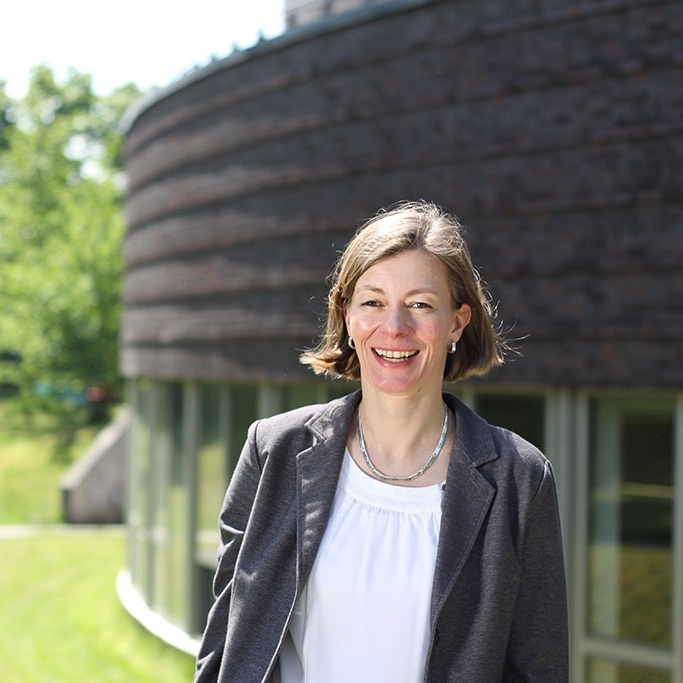

::: {.page-header style="background-image: url('/assets/images/banners/team.jpg');"}
[Team]{.page-header__title}

[&copy; [Anne Gärtner](https://www.gaertner-photo.de)]{.backimage-caption}
:::

::: {.content-section}
::: {.content-block}
::: {.profile-page}

::: {.profile-sidebar}
{.profile-avatar}

::: {.profile-contact}
-  Building Q Room 1.034
-  +49 40 42878-4765
-  birgit.grabi@tuhh.de
:::

::: {.profile-social}
[](mailto:birgit.grabi@tuhh.de "Email")
:::

:::

::: {.profile-main}

## Interests

::: {.profile-interests}
- Family
- Garden
:::

## Education

::: {.profile-education}
- [Team and Project Manager at the Institute of Entrepreneurship]{.profile-education__position} [Hamburg University of Technology, Germany]{.profile-education__institution} [2014 - current]{.profile-education__year}
- [Assistant at the Institute of Controlling and Simulation]{.profile-education__position} [Hamburg University of Technology, Germany]{.profile-education__institution} [2008 - 2014]{.profile-education__year}
- [Assistant to Doctoral Degree Committee]{.profile-education__position} [Hamburg University of Technology, Germany]{.profile-education__institution} [2012]{.profile-education__year}
- [Assistant at the Institute for River and Coastal Engineering]{.profile-education__position} [Hamburg University of Technology, Germany]{.profile-education__institution} [2002 - 2008]{.profile-education__year}
- [Assistant at the Institute of Mechanics and Ocean Engineering]{.profile-education__position} [Hamburg University of Technology, Germany]{.profile-education__institution} [2000 - 2001]{.profile-education__year}
- [Assistant to the Board]{.profile-education__position} [Hamburg University of Technology, Germany]{.profile-education__institution} [1999 - 2000]{.profile-education__year}
- [Assistant to CEO and CFO]{.profile-education__position} [Bacardi GmbH, Hamburg]{.profile-education__institution} [1990 - 1999]{.profile-education__year}
- [Assistant to Manager Controlling and Accounting]{.profile-education__position} [Braun AG, Kronberg im Taunus]{.profile-education__institution} [1988 - 1990]{.profile-education__year}
- [International Management Assistant / Europa-Sekretaerin]{.profile-education__position} [Academy for Management Assistants (AMA), Lippstadt, Foreign Language Studies]{.profile-education__institution} [1988]{.profile-education__year}
:::

:::

:::
:::
:::
