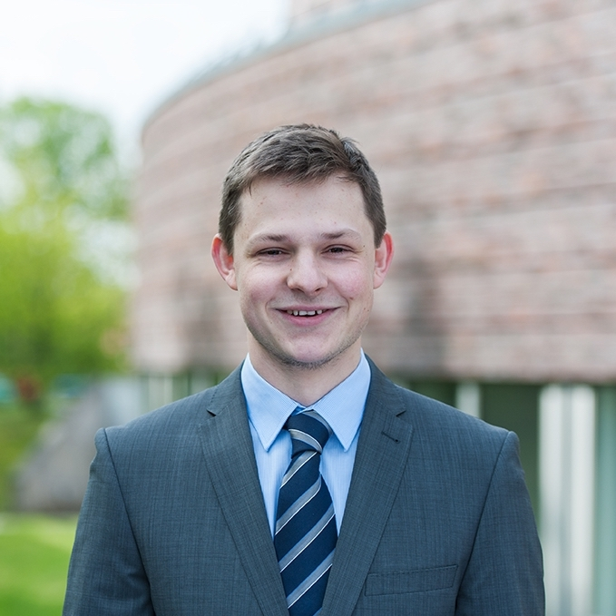

::: {.page-header style="background-image: url('../../assets/images/banners/team.jpg');"}
[Team]{.page-header__title}

[&copy; [Anne Gärtner](https://www.gaertner-photo.de)]{.backimage-caption}
:::

::: {.content-section}
::: {.content-block}
::: {.profile-page}

::: {.profile-sidebar}
{.profile-avatar}

::: {.profile-contact}
-  Building Q Room 1.032
-  +49 40 42878-4738
-  dimitri.graf@tuhh.de
:::

::: {.profile-social}
[](mailto:dimitri.graf@tuhh.de "Email") [](https://www.linkedin.com/in/dimitri-graf-980a06a2/ "LinkedIn")
:::

:::

::: {.profile-main}

## Biography

My research interests include science of science, computational social science and machine learning.

## Research Interests

::: {.profile-interests}
- Science of science
- Social networks
- Natural language processing
- Deep learning
- Computational social science
:::

## Appointments & Education

::: {.profile-education}
- [PhD in Computational Social Science]{.profile-education__position} [Hamburg University of Technology, Germany]{.profile-education__institution} [2016 - current]{.profile-education__year}
- [MSc in Industrial Engineering & Management]{.profile-education__position} [Hamburg University of Technology, Germany]{.profile-education__institution} [2015]{.profile-education__year}
- [BSc in Engineering and Management]{.profile-education__position} [University of Bremen, Germany]{.profile-education__institution} [2011]{.profile-education__year}
:::

## Selected Publications

:::: {#selected-pubs}
::::

:::

:::
:::
:::
