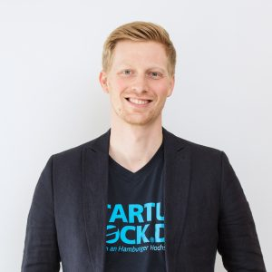

::: {.content-section}
::: {.content-block}
::: {.profile-page}

::: {.profile-sidebar}
{.profile-avatar}

### Dr. Jens Heckmann {.profile-name}

[Research Assistant & Doctoral Student]{.profile-role}

::: {.profile-contact}
-  Building Q Room 1.010
-  +49 40 42878-4774
-  jens.heckmann@tuhh.de
:::

::: {.profile-social}
[](mailto:jens.heckmann@tuhh.de "Email") [](https://www.linkedin.com/in/jens-heckmann-628bb193/ "LinkedIn")
:::

:::

::: {.profile-main}

## Biography

My research interests include cultural entrepreneurship, venture capital and natural language processing.

## Interests

::: {.profile-interests}
- Cultural entrepreneurship
- Venture capital
- Natural language processing
- Social evaluation of organizations
:::

## Education

::: {.profile-education}
- [Research Assistant & Doctoral Student]{.profile-education__position} [Hamburg University of Technology, Germany]{.profile-education__institution} [2017 - current]{.profile-education__year}
- [Startup Consultant @ Startup Dock - Center for Entrepreneurship]{.profile-education__position} [Hamburg University of Technology, Germany]{.profile-education__institution} [2017 - 2018]{.profile-education__year}
- [Consultant]{.profile-education__position} [McKinsey & Company, Germany]{.profile-education__institution} [2015 - current]{.profile-education__year}
- [MSc in Engineering and Business Administration]{.profile-education__position} [RWTH Aachen University, Germany]{.profile-education__institution} [2014]{.profile-education__year}
- [BSc in Engineering and Business Administration]{.profile-education__position} [RWTH Aachen University, Germany]{.profile-education__institution} [2012]{.profile-education__year}
:::

:::

:::
:::
:::
