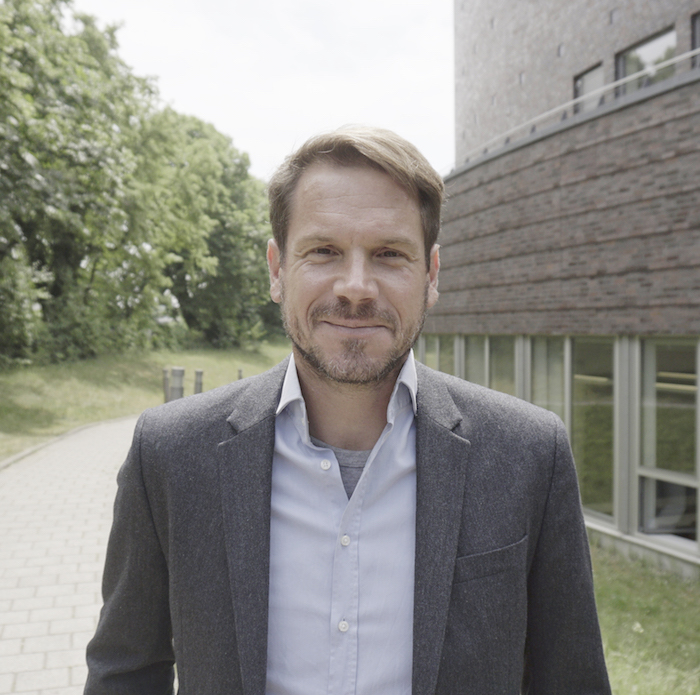

::: {.page-header style="background-image: url('../../assets/images/banners/team.jpg');"}
[Team]{.page-header__title}

[&copy; [Anne Gärtner](https://www.gaertner-photo.de)]{.backimage-caption}
:::

::: {.content-section}
::: {.content-block}
::: {.profile-page}

::: {.profile-sidebar}
{.profile-avatar}

::: {.profile-contact}
-  Building Q Room 1.033
-  +49 40 42878-4765
-  christoph.ihl@tuhh.de
:::

::: {.profile-social}
[](mailto:christoph.ihl@tuhh.de "Email") [](https://www.linkedin.com/in/christoph-ihl "LinkedIn") [](https://twitter.com/Ihluminate "Twitter") [](https://scholar.google.co.uk/citations?user=rOAPv_gAAAAJ "Google Scholar") [](https://www.researchgate.net/profile/Christoph_Ihl "ResearchGate") [](https://orcid.org/0000-0002-0842-5201 "ORCID") [](https://github.com/christophihl "GitHub")
:::

:::

::: {.profile-main}

## Biography

I am Professor of Management at Hamburg University of Technology (TUHH) and Head of the TUHH Institute of Entrepreneurship (TIE). My research on entrepreneurship and innovation lies at the intersection of organizational theory, sociology, and strategy. I study how actors shape and are shaped by their social, cultural, and technological environments as they create novelty in ideas, teams, products, practices, and business models.

Empirically, I focus on settings in which market, technological, social, or cultural spaces can be observed and measured systematically, including startup innovation, academic science, creative industries, and user communities. I deeply enjoy generating insights from novel data using computational social science and quantitative methods, including econometrics, network analysis, and natural language processing.

In teaching, I bring together rigorous scientific thinking and entrepreneurial practice. Drawing on experiences from universities with strong entrepreneurial cultures, I engage students in hands-on startup engineering and support them in developing and validating their own venture ideas through evidence-based experimentation. I also collaborate regularly with startups and established firms on business model innovation and data analytics.

## Interests

::: {.profile-interests}
- Startup Strategy & Finance
- Technology & Science-based Entrepreneurship
- Entrepreneurial Teams & Organization
- Crowd-based Innovation
- Creative Industries
:::

## Education

::: {.profile-education}
- [Professor & Head of Institute of Entrepreneurship]{.profile-education__position} [Hamburg University of Technology, Germany]{.profile-education__institution} [2014 - current]{.profile-education__year}
- [Academic Director of Startup Dock - Center for Entrepreneurship]{.profile-education__position} [Hamburg University of Technology, Germany]{.profile-education__institution} [2014 - 2018]{.profile-education__year}
- [Assistant Professor]{.profile-education__position} [RWTH Aachen University, Germany]{.profile-education__institution} [2008 - 2014]{.profile-education__year}
- [PhD in Management]{.profile-education__position} [Technical University of Munich, Germany]{.profile-education__institution} [2008]{.profile-education__year}
- [MSc in Engineering and Management]{.profile-education__position} [Technical University of Berlin, Germany]{.profile-education__institution} [2001]{.profile-education__year}
- [MBA]{.profile-education__position} [University of British Columbia, Vancouver, Canada]{.profile-education__institution} [1998]{.profile-education__year}
- [BSc in Engineering and Management]{.profile-education__position} [Technical University of Kaiserslautern, Germany]{.profile-education__institution} [1995]{.profile-education__year}
:::

## Selected Publications

:::: {#selected-pubs}
::::

:::

:::
:::
:::
