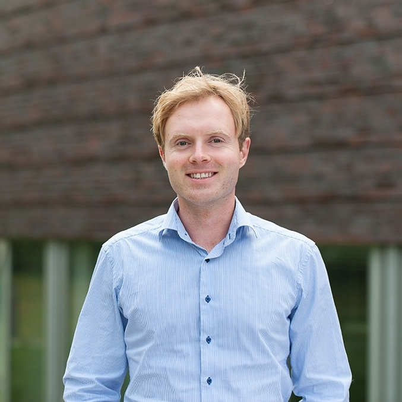

::: {.page-header style="background-image: url('../../assets/images/banners/team.jpg');"}
[Team]{.page-header__title}

[&copy; [Anne Gärtner](https://www.gaertner-photo.de)]{.backimage-caption}
:::

::: {.content-section}
::: {.content-block}
::: {.profile-page}

::: {.profile-sidebar}
{.profile-avatar}

::: {.profile-social}
[](https://de.linkedin.com/in/dr-matthias-jacobi-306792b4 "LinkedIn")
:::

:::

::: {.profile-main}

## Biography

Startup Failure, Media Sentiment, Social Judgement

## Interests

::: {.profile-interests}
- Startup failure
- Media sentiment
- Entrepreneurship culture
- Serial entrepreneurship
- Social judgement
:::

## Education

::: {.profile-education}
- [Head of Transformation]{.profile-education__position} [Syntegon / Bosch Packaging Technology]{.profile-education__institution} [2019 - 2020]{.profile-education__year}
- [Startup Consultant @ Startup Dock - Center for Entrepreneurship]{.profile-education__position} [Hamburg University of Technology, Germany]{.profile-education__institution} [2017 - 2018]{.profile-education__year}
- [PhD in Management]{.profile-education__position} [Hamburg University of Technology, Germany]{.profile-education__institution} [2015 - 2018]{.profile-education__year}
- [Operations Specialist]{.profile-education__position} [McKinsey & Company, Hamburg, Germany]{.profile-education__institution} [2013 - 2019]{.profile-education__year}
- [BSc & MSc in Physics]{.profile-education__position} [University of Hamburg, Germany]{.profile-education__institution} [2006 - 2009]{.profile-education__year}
:::

:::

:::
:::
:::
