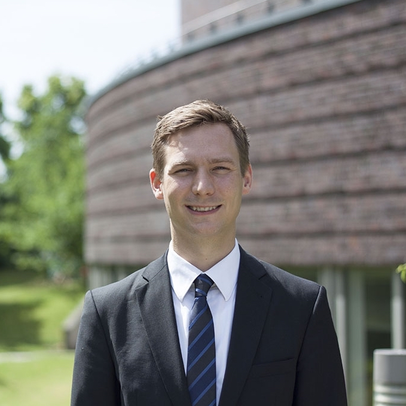

::: {.page-header style="background-image: url('../../assets/images/banners/team.jpg');"}
[Team]{.page-header__title}

[&copy; [Anne Gärtner](https://www.gaertner-photo.de)]{.backimage-caption}
:::

::: {.content-section}
::: {.content-block}
::: {.profile-page}

::: {.profile-sidebar}
{.profile-avatar}

::: {.profile-contact}
-  Building Q Room 1.031
-  +49 40 42878-4743
-  hannes.lampe@tuhh.de
:::

::: {.profile-social}
[](mailto:hannes.lampe@tuhh.de "Email") [](https://de.linkedin.com/in/hannes-lampe-86380740/ "LinkedIn") [](https://scholar.google.de/citations?user=3OREuykAAAAJ&hl=de&oi=ao "Google Scholar") [](https://www.researchgate.net/profile/Hannes_Lampe "ResearchGate") [](https://orcid.org/0000-0003-1375-236X "ORCID")
:::

:::

::: {.profile-main}

## Biography

My research interests lie at the intersection of Technology, Innovation and Entrepreneurship (TIE) and Public and Nonprofit Management (PNP).

## Interests

::: {.profile-interests}
- Public management
- Science of science
- Technology entrepreneurship
- Natural language processing
- Social evaluation of organizations
:::

## Education

::: {.profile-education}
- [Post-Doc]{.profile-education__position} [Hamburg University of Technology, Germany]{.profile-education__institution} [2015 - current]{.profile-education__year}
- [PhD in Public Management]{.profile-education__position} [University of Hamburg, Germany]{.profile-education__institution} [2015]{.profile-education__year}
- [Research Associate]{.profile-education__position} [Hamburg University of Technology, Germany]{.profile-education__institution} [2014 - 2015]{.profile-education__year}
- [Research Associate]{.profile-education__position} [Johannes Kepler University Linz, Austria]{.profile-education__institution} [2013 - 2014]{.profile-education__year}
- [Research Associate]{.profile-education__position} [University of Hamburg, Germany]{.profile-education__institution} [2011 - 2013]{.profile-education__year}
- [Diploma in Business Administration]{.profile-education__position} [University of Osnabrück, Germany]{.profile-education__institution} [2011]{.profile-education__year}
- [Diploma in Economics]{.profile-education__position} [University of Osnabrück, Germany]{.profile-education__institution} [2010]{.profile-education__year}
:::

## Selected Publications

:::: {#selected-pubs}
::::

:::

:::
:::
:::
