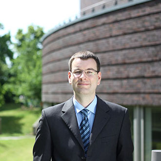

::: {.page-header style="background-image: url('../../assets/images/banners/team.jpg');"}
[Team]{.page-header__title}

[&copy; [Anne Gärtner](https://www.gaertner-photo.de)]{.backimage-caption}
:::

::: {.content-section}
::: {.content-block}
::: {.profile-page}

::: {.profile-sidebar}
{.profile-avatar}

::: {.profile-social}
[](https://www.linkedin.com/in/jan-reerink-5b377b102 "LinkedIn")
:::

:::

::: {.profile-main}

## Biography

Technology Transfer, Crowdsourcing, Academic Patenting, Nano Technology

## Research Interests

::: {.profile-interests}
- Technology transfer
- Crowdsourcing
- Academic Patenting
- Nano Technology
:::

## Appointments & Education

::: {.profile-education}
- [Data Scientist]{.profile-education__position} [Airbus Defence and Space, Hamburg, Germany]{.profile-education__institution} [2018 - current]{.profile-education__year}
- [PhD in Management]{.profile-education__position} [Hamburg University of Technology, Germany]{.profile-education__institution} [2014 - 2016]{.profile-education__year}
- [PhD in Management]{.profile-education__position} [RWTH Aachen University, Germany]{.profile-education__institution} [2010 - 2014]{.profile-education__year}
- [BSc & MSc in Industrial Engineering and Management]{.profile-education__position} [RWTH Aachen University, Germany]{.profile-education__institution} [2004 - 2010]{.profile-education__year}
:::

## Selected Publications

:::: {#selected-pubs}
::::

:::

:::
:::
:::
