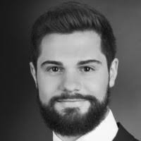

::: {.page-header style="background-image: url('../../assets/images/banners/team.jpg');"}
[Team]{.page-header__title}

[&copy; [Anne Gärtner](https://www.gaertner-photo.de)]{.backimage-caption}
:::

::: {.content-section}
::: {.content-block}
::: {.profile-page}

::: {.profile-sidebar}
{.profile-avatar}

::: {.profile-contact}
-  Building Q Room 1.010
-  +49 40 42878-4697
-  joschka.schwarz@tuhh.de
:::

::: {.profile-social}
[](mailto:joschka.schwarz@tuhh.de "Email") [](https://www.linkedin.com/in/joschka-schwarz-b52322146/ "LinkedIn") [](https://www.researchgate.net/profile/Joschka_Schwarz "ResearchGate") [](https://github.com/jwarz "GitHub")
:::

:::

::: {.profile-main}

## Biography

My research interests include social network dynamics and computational social science with a focus on the computational analysis of language.

## Interests

::: {.profile-interests}
- Digital entrepreneurship
- Venture capital
- Social networks and peer effects
- Crowdsourced knowledge and innovation
- Natural language processing
:::

## Education

::: {.profile-education}
- [PhD in Management]{.profile-education__position} [Hamburg University of Technology, Germany]{.profile-education__institution} [2019]{.profile-education__year}
- [Innovation & Technology Project Lead]{.profile-education__position} [Lufthansa Technik AG, Germany]{.profile-education__institution} [2017-2019]{.profile-education__year}
- [Internships & student work in management consulting and the automotive industry]{.profile-education__position} [Fraunhofer IPT & ILT, Aachen, Germany]{.profile-education__institution} [2011-2017]{.profile-education__year}
- [Exchange student at the School of Business and Economics]{.profile-education__position} [Maastricht University, Netherlands]{.profile-education__institution} [2016]{.profile-education__year}
- [MSc in Business Administration and Engineering - Materials and Process Engineering]{.profile-education__position} [RWTH Aachen University, Germany]{.profile-education__institution} [2015 - 2018]{.profile-education__year}
- [Exchange student at the Faculty of Business Administration & School of Industrial Engineering]{.profile-education__position} [Polytechnic University of Valencia, Spain]{.profile-education__institution} [2014]{.profile-education__year}
- [BSc in Business Administration and Engineering - Materials and Process Engineering]{.profile-education__position} [RWTH Aachen University, Germany]{.profile-education__institution} [2011 - 2015]{.profile-education__year}
:::

:::

:::
:::
:::
