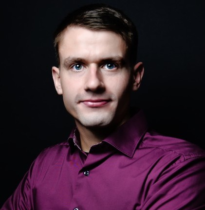

::: {.content-section}
::: {.content-block}
::: {.profile-page}

::: {.profile-sidebar}
{.profile-avatar}

### Oliver Specht {.profile-name}

[Research Assistant & Doctoral Student]{.profile-role}

::: {.profile-contact}
-  Building Q Room 1.031
-  +49 40 42878-4743
-  oliver.specht@tuhh.de
:::

::: {.profile-social}
[](mailto:oliver.specht@tuhh.de "Email") [](https://de.linkedin.com/in/oliver-specht-14411a162 "LinkedIn")
:::

:::

::: {.profile-main}

## Biography

My research interests are technology entrepreneurship and venture capital financing.

## Interests

::: {.profile-interests}
- Value Co-Creation between Startup Founders & Investors
:::

## Education

::: {.profile-education}
- [PhD in Management]{.profile-education__position} [Hamburg University of Technology, Germany]{.profile-education__institution} [2022 - current]{.profile-education__year}
- [Research Assistant]{.profile-education__position} [University of Technology Chemnitz, Germany]{.profile-education__institution} [2020 - 2022]{.profile-education__year}
- [Working Student]{.profile-education__position} [Stadler Pankow GmbH, Germany]{.profile-education__institution} [2019 - 2020]{.profile-education__year}
- [Master of Science in Industrial Engineering and Management]{.profile-education__position} [Technische Universität Berlin, Germany]{.profile-education__institution} [2020]{.profile-education__year}
- [Working Student]{.profile-education__position} [Deloitte GmbH, Berlin, Germany]{.profile-education__institution} [2017 - 2019]{.profile-education__year}
- [Bachelor of Science in Industrial Engineering and Management]{.profile-education__position} [Technische Universität Berlin, Germany]{.profile-education__institution} [2017]{.profile-education__year}
:::

:::

:::
:::
:::
