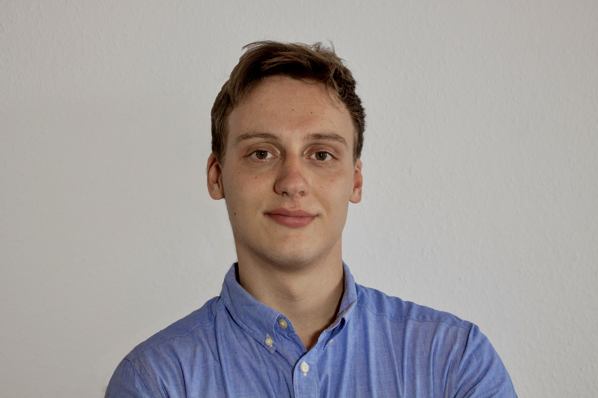

::: {.content-section}
::: {.content-block}
::: {.profile-page}

::: {.profile-sidebar}
{.profile-avatar}

### Jürgen Christopher Thiesen {.profile-name}

[Research Assistant & Doctoral Student]{.profile-role}

::: {.profile-contact}
-  Building Q Room 1.032
-  +49 40 42878-4845
-  juergen.thiesen@tuhh.de
:::

::: {.profile-social}
[](mailto:juergen.thiesen@tuhh.de "Email") [](https://www.linkedin.com/in/jürgenchristopherthiesen/ "LinkedIn") [](https://github.com/juergenct "GitHub")
:::

:::

::: {.profile-main}

## Biography

My research interests include the wide field of green technologies and sustainable entrepreneurship.

## Interests

::: {.profile-interests}
- Green Technologies/Clean Technologies
- Sustainable Entrepreneurship
- Renewable Energy
:::

## Education

::: {.profile-education}
- [PhD in Management & Engineering]{.profile-education__position} [Hamburg University of Technology, Germany]{.profile-education__institution} [2023 - current]{.profile-education__year}
- [Business Development Manager]{.profile-education__position} [GP JOULE Connect GmbH, Germany]{.profile-education__institution} [2021 - 2022]{.profile-education__year}
- [Master of Science in International Management and Engineering]{.profile-education__position} [Hamburg University of Technology, Germany]{.profile-education__institution} [2021]{.profile-education__year}
- [Working Student Business Development and Product Management]{.profile-education__position} [GP JOULE Connect GmbH, Germany]{.profile-education__institution} [2021]{.profile-education__year}
- [Internship in Controlling Development and Project Controlling Digitization]{.profile-education__position} [Audi AG, Germany]{.profile-education__institution} [2020]{.profile-education__year}
- [Exchange Semester]{.profile-education__position} [Chalmers University of Technology, Sweden]{.profile-education__institution} [2019]{.profile-education__year}
- [Internship Research and Development Electric Grid]{.profile-education__position} [ABB AG, Germany]{.profile-education__institution} [2018]{.profile-education__year}
- [Bachelor of Science in Electrical Engineering and Management]{.profile-education__position} [Kiel University, Germany]{.profile-education__institution} [2018]{.profile-education__year}
- [Working Student at the Chair of Power Electronics]{.profile-education__position} [Kiel University, Germany]{.profile-education__institution} [2017]{.profile-education__year}
:::

:::

:::
:::
:::
