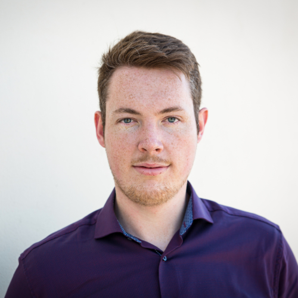

::: {.page-header style="background-image: url('../../assets/images/banners/team.jpg');"}
[Team]{.page-header__title}

[&copy; [Anne Gärtner](https://www.gaertner-photo.de)]{.backimage-caption}
:::

::: {.content-section}
::: {.content-block}
::: {.profile-page}

::: {.profile-sidebar}
{.profile-avatar}

::: {.profile-contact}
-  Building Q Room 1.032
-  +49 40 42878-4738
-  jonas.wilinski@tuhh.de
:::

::: {.profile-social}
[](mailto:jonas.wilinski@tuhh.de "Email") [](https://www.linkedin.com/in/jonas-wilinski-a31a35143/ "LinkedIn") [](https://github.com/J0nasW "GitHub")
:::

:::

::: {.profile-main}

## Biography

My research interests span across the wide field of AI and Machine Learning in combination with managerial and cultural implications.

## Interests

::: {.profile-interests}
- Machine Learning and AI especially in combination with NLP and Vision
- Crowdsourced knowledge and innovation
- Social Engineering
:::

## Education

::: {.profile-education}
- [PhD in Management & Engineering]{.profile-education__position} [Hamburg University of Technology, Germany]{.profile-education__institution} [2022 - current]{.profile-education__year}
- [CTO & Product Owner]{.profile-education__position} [Startup "Cargofaces", Germany]{.profile-education__institution} [2021 - 2022]{.profile-education__year}
- [Master of Science in International Management and Engineering]{.profile-education__position} [Hamburg University of Technology, Germany]{.profile-education__institution} [2019 - 2021]{.profile-education__year}
- [Working Student]{.profile-education__position} [Hamburg University of Technology, Germany]{.profile-education__institution} [2020 - 2021]{.profile-education__year}
- [Project Manager]{.profile-education__position} [Dr. Ing. h. c. F. Porsche AG, Germany]{.profile-education__institution} [2018 - 2019]{.profile-education__year}
- [Internship in the automotive industry]{.profile-education__position} [Dr. Ing. h. c. F. Porsche AG, Germany]{.profile-education__institution} [2017 - 2018]{.profile-education__year}
- [Bachelor of Science in Electrical Engineering and Management]{.profile-education__position} [Kiel University, Germany]{.profile-education__institution} [2014 - 2018]{.profile-education__year}
- [Working Student]{.profile-education__position} [Kiel University, Germany]{.profile-education__institution} [2016 - 2017]{.profile-education__year}
:::

## Selected Publications

:::: {#selected-pubs}
::::

:::

:::
:::
:::
